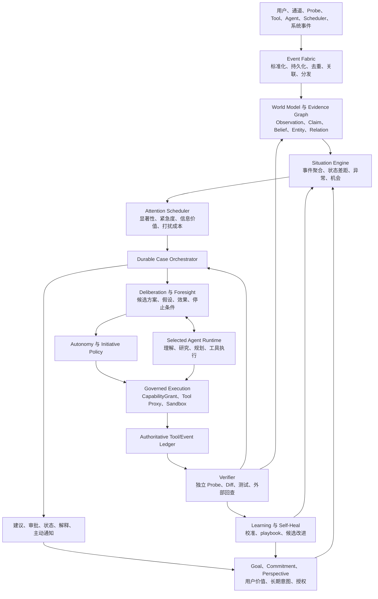
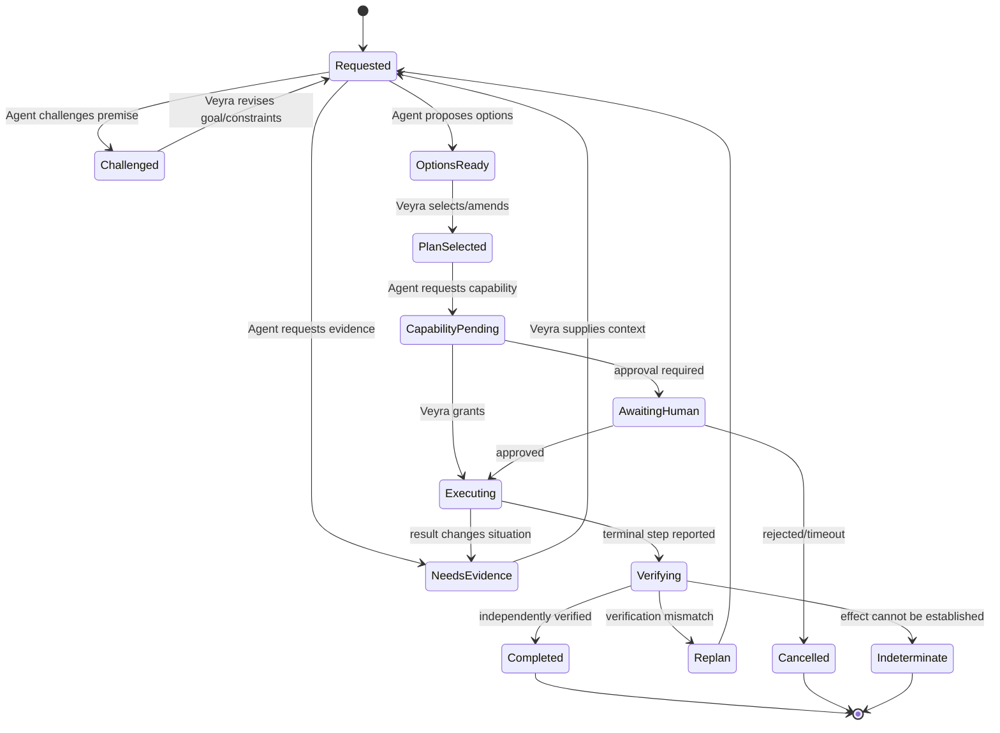
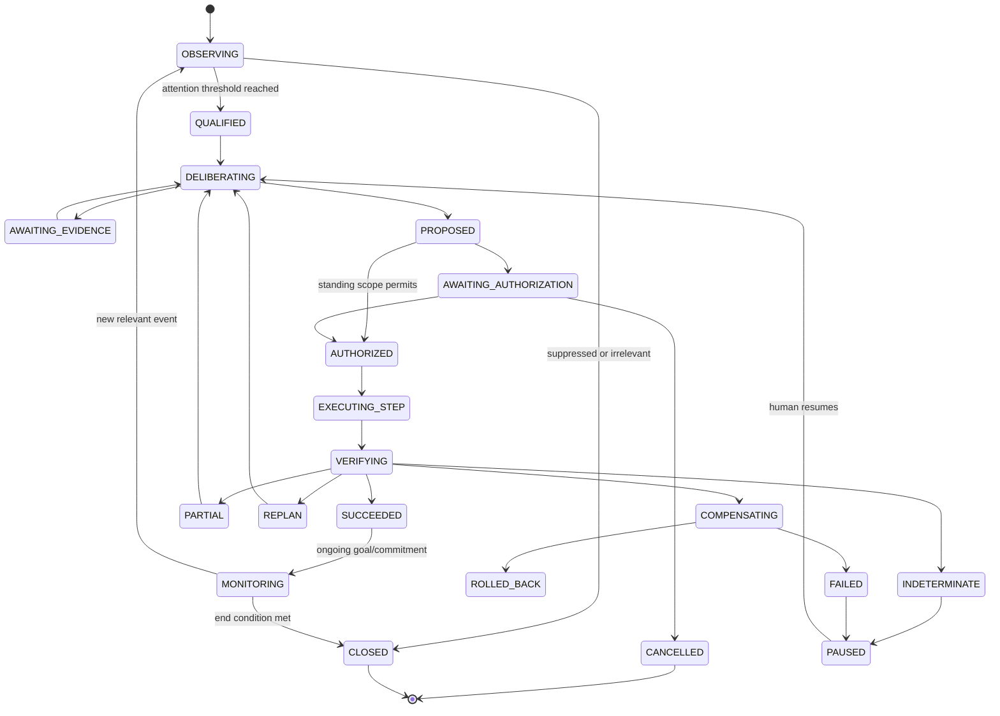

# Veyra 主动认知与受治理自主架构

> 状态：目标架构与实施蓝图
>
> 设计核验基线：2026-07-28；以当前代码、Git、自动化 gate 和重启后的真实运行证据为准
>
> 适用范围：Veyra 本地控制面、选定 Agent Runtime、主动感知、长期任务、治理执行与学习闭环
>
> 本文不是对旧设计的照搬，也不宣称 Veyra 具有生物意识。它把“像贾维斯一样持续理解环境、主动建议、协调 Agent、有限自治和自我恢复”的产品目标，转换成可以逐步实现和验收的工程系统。

## 1. 结论

用户提出的方向可行、有用，并且比“Veyra 只是 Agent 前面的安全门”更完整。

Veyra 应当主导整个长期闭环，但不是独自完成所有认知和执行：

```text
用户拥有最终目标和授权
        ↓
Veyra 持续感知、维护世界模型、选择关注事项、形成情境和目标
        ↓
Veyra 与 Agent 双向协商，让 Agent 负责开放式理解、研究、规划和工具使用
        ↓
Veyra 比较方案、约束权限、签发能力、跟踪执行、验证结果
        ↓
Veyra 更新世界状态、承诺、经验和下一次主动行为
```

这不是“Veyra 负责治理、Agent 负责干活”这么简单。目标关系是：

- Veyra 决定为什么现在处理、服务哪个目标、应关注什么、向哪个 Agent 求助、允许多大范围、何时停止、怎样判断完成、是否应主动告诉用户。
- Agent 决定如何理解开放任务、怎样研究和分解、在已授权范围内怎样使用工具，并且可以向 Veyra质疑前提、请求证据或提出替代方案。
- 真实证据高于 Veyra 和 Agent 的预测；用户授权高于二者的行动意愿。
- Veyra 对系统行为具有最终治理权，但不垄断事实判断，也不重复实现一个完整 Agent Runtime。

因此，Veyra 的目标定位应更新为：

> **一个由 Veyra 主导、面向 Agent 协作的持久认知主管与受治理控制实体。它通过适配成熟 Agent 获得开放认知和执行能力，通过证据、持久状态和权限系统保持连续、自主且人为可控。**

### 1.1 本次已经落地的第一阶段

本文基线之后已经实现一个受控的“事件—情境候选”基础切片：

- `VeyraEvent` 已扩展 observation、state change、task progress/completion、commitment due、component degraded 和 user feedback，并加入 correlation、causation、evidence、dedupe、时间与 privacy scope；
- `EventInbox` 已提供有限持久去重、租约 claim、重试、崩溃恢复、用户边界、容量上限，以及只淘汰终态记录的保留策略；同一事件重投把 transport `received_at` 作为 delivery metadata，不再误判为业务冲突；
- foreground shadow admission 与 claim 已合并为一次原子状态变更，并始终返回 dedupe 后的 canonical event identity，后台消费者不能再从两步操作之间抢走事件；
- EventInbox 会递归最小化常见自由文本和 secret-like 字段；默认不会再保存消息原文或可用于短文本反推的无盐摘要；
- `SituationEvaluator` 当前把每个事件投影为一个 `situation_candidate`，并关联用户、会话、目标、承诺、证据、显著性、决策和结果；它还不是多事件聚合的 Situation Engine；
- 同源精确 replay 是 state/trace no-op；同源信息更新可以增加 observation revision，但不能把已终结 Situation 重新变成 due；
- Situation 状态转换和完整 trace entry 先在同一个 JSON 状态变更中进入有条目数、单条序列化字节数和总字节数上限的 durable outbox，再投递到 append-only JSONL；append 前失败和 append 后、ack 前中断都可按确定性 `transition_id` 修复且不重复，持续故障达到上限时会在未审计转换提交前施加背压；
- foreground decision 与 outcome 通过稳定 resolution key 在一次状态变更中原子提交；临时失败可立即重试，重复 delivery 可以修复未完成 resolution，但不会重复 lifecycle history；
- `situation_trace` 有 pending outbox 时 retention 必须延期；先完成 append/ack 去重，再 archive-before-truncate，避免已归档 transition 被恢复逻辑重复补写；
- 默认 `record_only` 模式只在 foreground turn 做一次有界 admission，情境候选投影由 `ActiveRuntimeLoop` 后台完成；显式 `shadow` 模式只用于评测完整生命周期；
- `disabled / record_only / shadow` 可以通过本地控制 API 切换，默认 `record_only`；持久 mode epoch 会阻断 disable→re-enable 之前排队的旧 projection，且三种模式都不向公开响应新增 Situation artifact；
- 入站 evidence ref 一律是非事实指针；只有解析到同一事件的持久 `execution_trace`、验证状态和证据后，enclosing outcome 才能成为 factual outcome；
- Situation/Event Inbox 调试读取必须显式提供 `user_id`，通用 `/state` 不返回这些集合；这只防止无意枚举，当前 loopback 管理面尚未把认证身份绑定到 user_id，不能宣传为安全多租户 API；
- 已增加故障注入、伪造 trace、跨用户、后台 tick、组合崩溃恢复、并发 claim、专属 trace retention，以及全部 9 个公开 Route 的完整输出、状态和风险等价 smoke；最终本机 30 次/路由/模式样本中 `record_only` 相对 `disabled` 的 p50 增量为 1.240–1.956 ms、p95 增量为 1.853–2.730 ms，完整 `shadow` 的 p50 增量为 19.127–25.701 ms、p95 增量为 31.809–39.803 ms。该 wall-clock benchmark 可复跑但只作诊断，不作为 CI 硬阈值；
- 当前生产接线只自动把 user-message intake 发布到 EventInbox；其余扩展事件类型已有 envelope、admission 和测试契约，但仍需要各 component/task/commitment 的真实 producer 显式调用 `publish_event()`，不能宣传为已接通的事件源。

这意味着 Phase 1 已完成“事件先可靠进入、关系可以在后台投影、失败可恢复且可审计、事实不能由模型或 artifact 自我认证”的有界基础切片。就 Phase 1 本身而言，它没有实现无限历史、长期 dedupe tombstone、多事件 Situation 聚合、主动决策、Attention 调度、Durable Case、Veyra-Agent 协商、真实 pre-tool enforcement 或自动自愈；后续已经落地的 Phase 2–4 范围必须按本节各自的验证状态解释，不能倒推为 Phase 1 当时已有。

### 1.2 当前已经落地的 Phase 2 read-only/shadow 技术闭环

当前版本加入了独立的只读 Project Guardian，并接通 `project_release_risk` 的确定性资格化、本地 Git、GitHub Actions、显式结构化 deployment intent、有界 Attention 调度和 shadow 投影；它仍不产生主动建议、通知或执行：

- 独立使用 `ops_config.project_guardian.mode = disabled / record_only / shadow`，默认 `disabled`；它不会改写 `event_awareness`、Tool Proxy、Active Loop 或任何执行配置；
- 已增加显式 release Goal 注册和状态更新；语义 `revision` 用于绑定 signal/candidate，另有每次实际变更递增的 `state_revision` 作为 CAS token，旧 token 不能覆盖 pause/complete 等并发更新。注册时用只读 Git 命令验证并私下绑定规范化 worktree root、完整 origin 摘要、完整 branch ref 和目标 SHA，公开 Goal 不保存本地路径；只有带受控 schema/source/state revision/target SHA 的 Goal 才能参与资格化，自由文本 `current_goal`、项目名称和原始消息都不能被用来猜发布目标；
- Goal 与信号必须在 `user / goal revision / workspace / repo / target ref / target environment / release cycle` 上完全一致；
- 已接入第一个真实 producer：Active Loop 在 Guardian 资格判断前，对每个有效 Goal 的绑定 worktree 执行环境隔离、`--no-replace-objects`、关闭 fsmonitor/optional locks 并固定 stat/file-mode/symlink/path-case/attributes 行为的只读 Git probe。每个采样都在临时只读 Git metadata 和空 repository config 中把复制的 source index 仅用于比较 index 与 HEAD，再从 HEAD 重建没有 worktree stat cache 的 fresh index 后执行 porcelain status；因此 tracked 内容必须重新核验，同长度改写并恢复 mtime 也不能依靠旧 stat cache 被误报为 clean。status 本身不读取或执行 worktree 的 clean/process filter，即使 filter config 在邻接检查间竞态变化也不能隐藏 dirty。探针同时严格要求唯一 origin fetch URL，拒绝 submodule/gitlink、私有 attributes、任一生效层级（含 include/worktree config）的 filter，以及 `assume-unchanged / skip-worktree / sparse` index 状态；host 的 Git path/config/object/trace 注入变量不会进入子进程。只有两次 status、index flags/stage 与其间、其后的 root、完整 origin 摘要、ref、SHA 都一致且仍精确匹配，才发布 `git_dirty present/clear`。命令失败、detached HEAD、replace/config/filter 歧义、被双样本检测到的文件/HEAD/origin/index 漂移或绑定损坏一律是 degraded/unknown，绝不发布 clear；`disabled` 不探测。由于 Veyra 不向其他 worktree 写入者施加共享锁，这只是有时间戳和 6 分钟有效期的 point-in-time 快照：最终读取之后发生的变化不会被伪装成 ingress 时刻的新事实，只能由下一轮探针更新；
- 已接入第二个真实 producer：GitHub Actions API poller 只向固定 `https://api.github.com` 发出不跟随重定向、忽略环境代理的认证 GET，请求 token 只从 `VEYRA_GITHUB_TOKEN` 读取且不进入 WorldState、EventInbox、signal ledger、run telemetry 或日志；本地 setup 可以把 token 写入权限为 `0600`、被 Git 忽略的 `.env`，因此不能宣称 raw token 绝不落盘。配置 CI 的 Goal 还必须证明本地 origin 是精确匹配的 `github.com/owner/repo`，本地 bare、GitLab/Bitbucket 或同名外部 host 不能与 GitHub API 事实拼接。Goal 注册时以 provider 返回的 numeric repository/workflow ID、workflow path、精确 required jobs、GitHub Actions app ID 和 `push` event 建立私有 CI policy；policy digest 同时进入 Goal semantic revision 与 workspace binding identity。每次观察按 Goal branch/SHA 查询指定 workflow，绑定最新 run/run attempt/check suite，再逐一核对 attempt-specific job 与对应 check-run 的 SHA、app 和 suite；结束前同时复读所选 run 并重新列举当前 run，run/attempt 竞态、缺失或重复 job、非终态、取消/neutral/skipped/stale、身份错配、分页不完整、API/时间错误都只产生 unknown，不发布 clear。只有全部 required jobs `completed + success` 才发布 clear；至少一个受认可的失败 conclusion 才发布 present。证据时间来自 provider completion time，不会被重复 poll 刷新，最大 age/TTL 为 30 分钟；最多保留 8 个未过期 active/paused CI binding，completed 或过期 Goal 释放容量；
- Git、CI 与 deployment-intent 各自使用一次性签发的独立进程内 capability ingress；scope、component、evidence、时间和 receipt 都由入口派生并与私有 workspace/origin/CI policy/Goal binding 核对。仓库或 CI policy 变化会生成新的 Goal 语义 revision，使旧 frontier 证据失效。全部 Git 探针先完成，再执行 CI 读取；畸形、超时或不可达 CI 不能跳过后续 Goal 的 Git 探针。通用 Event Fabric 对保留 signal channel 一律拒绝，foreground user intake 也不能复用 signal 或 Guardian projection 两个保留 channel；只有 Inbox admission 与 compact signal ledger 均确认后 producer 才报告发布成功；后台消费只修复/确认 ledger，不把单个生产者信号投影成通用 Situation。receipt 是本地可信状态边界内的完整性绑定标识，**不是 HMAC、签名或 webhook 签名**；
- 结构化 deployment intent 只能由显式本地控制命令产生，不能从自然语言、模型输出、Goal 注册或定时 tick 推断；`declare → present`、`withdraw → clear`，命令精确绑定 user、session、Goal revision/state CAS、SHA、environment 和 occurred_at。稳定 operation id 只以 user-scoped digest 持久化；同语义重投幂等，复用 operation id 改语义会被拒绝，Inbox 与 signal ledger 必须双提交后才算 committed；
- 资格化要求 `git_dirty / ci_failed / deployment_intent` 中至少两个不同 producer/signal class、不同 provenance lineage 且 30 分钟内相关；当前三条路径均已接通，任一单信号仍不能独自形成候选；
- 只有精确匹配结构化 active release Goal 的信号才可进入独立、紧凑且有界的 `project_guardian_signal_state` frontier；资格判断不依赖 EventInbox 的终态保留期，Inbox 已提交而 frontier 写入中断时可在重启/tick 中幂等补建；
- `received_at` 只表示传输到达时间，不能刷新旧证据；更新的 `clear` 状态会覆盖同类旧 positive 状态；producer 时间只有秒级、present 与 clear 同时刻且没有 sequence 时，保守地让 clear tombstone 优先；
- `record_only` 仅持久化有界 would-fire 评测；`shadow` 只向现有 EventInbox 发布一个结构化 Observation，下一次 Event Fabric 消费才形成没有 Decision/Outcome 的 Situation 投影；
- candidate identity 对 Goal 与 release scope 稳定，完整规范化候选语义绑定 candidate revision；同一 candidate 的增量 revision、Goal pause/complete 的 closure、同 revision 再 active 的 reopen 都使用单调 projection sequence 合并进同一 Situation，乱序旧投影只能补历史，不能回滚当前 head；
- EventInbox admission 只记录 `admitted`，只有 Situation 中存在对应语义 projection 才记录 `projected`；崩溃、重启和 transport retry 不得把排队或重复入队误报为已投影；
- 开放 lifecycle 使用独立 compact head，不会被有界失败历史挤掉；候选容量不足时先拒绝新 projection 并显式 degraded，不发布无法持久保留 lifecycle 的孤儿；
- Goal、signal frontier 或 Guardian lifecycle state 损坏时冻结既有 lifecycle 并显式 degraded；未知输入不能被当作 no-signal 而关闭 Situation，也不能覆盖损坏状态；
- Guardian 与 Event Fabric 各自使用持久 mode epoch，mode 复查与 EventInbox admission/claim 使用同一状态写闸门；disable 成功后，已排队但未消费的旧 epoch Guardian Event 会被标记 suppressed，重新启用必须使用新的 transport attempt；
- `project_guardian_state` 是 TTL 为 0 的 shadow telemetry，不进入通用 stale-state → 主动 intention 链；
- Project Guardian 不注入 Agent、ReviewQueue、AlertDispatcher、CommitmentPush、ActionExecutor、SafeTool 或通知通道；候选固定为 `agent_invoked=false / shadow_only=true / notification_allowed=false / execution_allowed=false / interrupt_eligible=false`，projection admission 会重新验证这些不可扩权字段；
- Attention 使用独立的确定性 scheduler 和 `project_guardian_attention_state`：显式 policy 精确绑定 user/Goal/revision/state CAS/scope、priority、deadline、timezone、pause、quiet hours、每日预算与显式 `attention_group_id`；缺失或语义损坏的上下文会保持 unknown/blocked，不能靠文本猜测。输出仅为 `suppressed / observe / investigate_read_only / would_suggest` 反事实 disposition；即使达到 act threshold 也没有行动权；
- pause、quiet hours、预算、dismiss 和 cooldown 有固定 suppression precedence；当前无通知通道，预算 `used=0`，runtime 不启动 cooldown，`investigate_read_only` 也不调用 Probe/Agent。只有同一 user、同一显式 group 且至少两个不同 candidate 才生成私有 grouped Attention situation；它不发布 Event、不写通用 `situation_state`，不等于通用多领域 Situation Engine；
- 独立调试接口只允许查看状态、切换三种模式、单独运行一次、提交严格结构化的 Goal/intent/Attention policy/dismiss 命令，以及按显式 `user_id` 逻辑过滤候选、assessment 和私有 grouped situation；可能执行 Git/GitHub I/O 的同步工作在线程池运行，不能阻塞 FastAPI event loop。无 user scope 的 producer status/run-once 只返回聚合计数，不返回 Goal/repo/ref/SHA 明细；通用 `/state` 不暴露 candidate、signal frontier、Attention 私有状态或 workspace binding。当前 `user_id` 仍由调用者声明，不是 auth-derived tenant boundary。

当前自动化覆盖 3 种双信号正组合、跨 session 聚合、Goal/用户/scope/time/revision 错误关联、producer/evidence/privacy/authority 字段伪造、同秒 clear、过期 tombstone、Inbox 淘汰、frontier crash repair、revision/closure/reopen、乱序 replay、跨实例 kill switch、epoch fence、重启去重、后台故障隔离和零业务副作用；Git 专项覆盖 worktree/origin/ref/SHA、index/filter/replace/config 竞态与 point-in-time 合同；CI 专项覆盖 provider binding、failure/pending-rerun/success、completion time、policy digest、repo/ref/SHA/workflow/app/job/attempt/分页/transport 错配、最终 run re-list 竞态、精确 github.com origin、畸形 provider、disabled 零请求、容量生命周期和真实 `git_dirty + ci_failed` shadow candidate；intent 专项覆盖无隐式推断、declare/withdraw、CAS、幂等/冲突、双提交修复和 reserved ingress；Attention 专项覆盖确定性 score、unknown context、阈值、suppression precedence、显式同用户分组、dismiss/restart、语义损坏 policy fail-closed、私有状态与全部 authority lock；HTTP 专项覆盖 strict schema 和 event-loop 非阻塞。全部 9 个 Route 在 Guardian/producer/intent/Attention 的 disabled、record-only、shadow 和故障情形下仍逐字段比较完整公开输出、状态和风险。16 组 canonical fixture 得到 precision/recall 1.0、错误关联 0、evidence contract 1.0；这是**规则级 fixture 证据，不是真实项目 replay 或人工建议 usefulness 证据**。标签盲、score 前 evaluator 重算、同次 bytes hash/parse、duplicate-key 拒绝、decision-semantic 去重、工件哈希与 evaluator ruleset 绑定、精确 TP/FP/FN 与双人评价门槛已经写入 [Project Guardian Held-out Replay 评估协议](./project_guardian_evaluation_protocol.md)，但当前没有合格真实数据集，结果必须保持 `not_ready`。

因此，Phase 2 的 **read-only/shadow 技术实现已完成**；formal promotion evidence 仍为 `validation_pending/not_ready`。在真实 held-out corpus、独立来源台账、冻结 labels、双人人工 usefulness 评测和最终推送 SHA 的 fresh live CI 证明完成前，不能进入 `advise_only`，不能发送通知，也不能获得执行权。

### 1.3 当前已经落地的 Phase 4 Durable Case 与有界 Agent 协商

当前版本已经把一次明确的 Agent 委托接入一个**分析/提案限定**的 Durable Case，并完成当前 Kimi + OpenClaw 配置下的真实运行验证：

- `core/durable_case.py` 冻结了严格、不可隐式类型转换的 Case/checkpoint/dialogue 模型；Case identity 精确绑定 user、workspace 和 source event，Phase 4 状态机只包含 `OBSERVING / QUALIFIED / DELIBERATING / AWAITING_EVIDENCE / PROPOSED / PAUSED / CANCELLING / CANCELLED / FAILED / INDETERMINATE / CLOSED`，刻意没有 `AUTHORIZED` 或 `EXECUTING`；
- `runtime/durable_case_store.py` 提供 revision CAS、operation-id 幂等与语义冲突检测、checkpoint/dialogue 原子提交、两阶段 cancel、trace outbox、终态保留和持久 round-robin recovery cursor；恢复预算耗尽不会长期饿死排在后面的 Case；
- `interface/agent_dialogue_contract.py` 和 `runtime/bounded_agent_negotiation.py` 当前只接受 `TASK_REQUEST / EVIDENCE_REQUEST / CHALLENGE / OPTION_SET`。reply 必须精确回显 Case revision、turn、parent、task、operation 和 scope 绑定；extra field、类型 coercion、自由文本推断或错绑一律不推进 Case。Agent 自报证据只算 reported proposal，最多得到 `partially_success`，不能成为事实、授权、执行或 verified outcome；
- TASK_REQUEST 会在 dispatch 前持久化；OpenClaw 使用 caller-supplied run identity 和同进程 bearer，callback 只作为 wake-up hint，Veyra 必须按持久绑定重新取得 exact run 观察。终态消息只有在 broker authority、插件 session 和必要的 Agent abort 状态全部闭合后才可推进；治理闭合不确定时 Case 保持可继续评估且 intake dedupe 不释放；
- `routers/cases.py` 提供 owner-scoped list/detail 和 strict command API；pause/close 不能跨过仍存活的 Agent authority，cancel/reconcile 使用 revision 和 operation ID。公开响应、callback、refresh、stop、LoopResult 与 `/state` 均使用专门投影，不暴露 provider run/session/binding/token、raw provider payload、全局 pending context 或其他用户任务；
- Agent adapter 合同保持 provider-neutral。当前真实验证使用 Kimi/Moonshot 配置的 OpenClaw：一个明确实现请求进入 `route=agent`，Kimi 返回严格 `EVIDENCE_REQUEST`，Case 到达 `AWAITING_EVIDENCE`，checkpoint 的 effect state 保持 `not_started`，治理 session 归零；同一 `message_id` 重放只返回 duplicate，工作区 Git diff 不变。Kimi 将普通结构化回答与 dialogue envelope 放在相邻 JSON block 时，adapter 只按有界 JSON 结构组合互不重叠的顶层字段；字段重叠或结构歧义仍 fail closed；
- 进程重启后的恢复、错绑 callback、terminal cache provenance、取消竞态、prepared-before-broker crash、同进程重复 submit、跨 provider 并发隔离、公开隐私边界、Phase 1 三个不变量与全部 9 Route 非弱化均进入 gate。

这不是通用工作流引擎或无限多轮 Agent 会话。当前每个 Case 只有一次 bounded Agent reply 预算；`AWAITING_EVIDENCE / PROPOSED / PAUSED` 之后的 evidence supply、plan selection、授权、执行和验证循环尚未开放。状态继续使用现有有界 JSON 原子存储，没有 SQLite 迁移，也没有引入 HMAC 归档、密钥轮换、旧索引迁移或压缩预算。其他模型/provider 需要分别完成 capability、严格输出质量和 live compatibility 验证，不能由 Kimi 的成功自动继承。

### 1.4 当前已经落地的 Phase 5.1 OpenClaw 传输自愈切片

当前版本只实现 Phase 5 的第一个窄切片：在固定本地 OpenClaw target 上观察并恢复 Gateway 传输。它默认 `shadow`，没有获得进程重启、provider/model 切换、Agent 调用、工具执行、workspace 修改或自我扩权能力：

- `core/autonomy_policy.py` 定义了不可变、domain-scoped 的 A0–A5 表达；本切片只实例化 `runtime_health` 的固定 A2 profile。权限精确绑定 local user、local environment、selected OpenClaw target、R1 ceiling、capability、运行模式、attempt budget、cooldown 和 policy revision；它不是全局自治等级，也不让其他 domain 自动继承 A2；
- `self_heal.openclaw_reconnect.v1` 默认 `shadow`，只有显式 `scoped_canary + mode_epoch` 才能进入恢复分支。触发前必须有两轮不同、至少间隔 1 秒且不超过 360 秒窗口的 fresh observation；每轮同时包含失败的 exact-port TCP Probe 和失败的 OpenClaw Gateway protocol/capability Probe。两轮完整证据链与 count 一起持久化，残缺、过旧组合或未知状态不能触发恢复；
- action-scope binding 同时包含选定 Agent 的完整业务配置摘要、规范 endpoint、adapter type 和 autonomy-policy revision，因此 protocol range、timeout、auth source、RPC path 等任一 selected-config 变化都会阻止旧观察或旧 adapter 结果提交；runtime identity 另以 endpoint + 显式 `self_heal_identity_epoch` 分账，无关的顶层 agent-config 写入不能清空已建立的 identity baseline。配置 endpoint 与实际 adapter endpoint 不同、target disabled、非本地 host、未知 operation schema、损坏 ops/state 或 scope/mode 变化都不会调用恢复；
- 恢复只允许一次 cache invalidation + force-refresh Gateway handshake，再由 fresh TCP 和严格 capability snapshot 双重验证。capability 必须证明兼容协议、健康、required methods、Phase 4 exact-run 特性、当前 enforced Tool Proxy profile 和 active task count 为零；成功前不会把 executor 标记 available。shadow 永不投影 executor；
- 第一次健康观察会建立不公开的 runtime identity baseline；同一 identity scope 下观察到意外 server protocol/version 会立即停止、熔断并请求人工检查，不能被标为 recovered。任一 selected-config 变化都会建立新的 action binding 并阻止旧 observation/attempt 继续；只有显式 endpoint 或 `self_heal_identity_epoch` 变化才会重置 identity baseline，timeout/protocol range 等非身份配置变化仍保留该 baseline；
- OpenClaw broker dispatch admission、Tool Governance session admission、self-heal transport call 和相关 config 写共用 authority fence。正常 config 变更与当前有界 run 按先后顺序线性提交；调用超时后仍允许持久化 revoke/disable，但该操作保持 `indeterminate`，后台 worker 真正结束前 Agent admission 继续关闭，迟到结果不能触发自动重放或 executor 投影。durable dispatch/attempt/session ledger 只接受明确终态 allowlist，任意 pending Agent task 或未知状态都 fail closed。该 fence 是既有 single-writer Veyra 进程内边界，不宣称约束另一个 Veyra 进程、OpenClaw 自身或未注册的外部 Agent session；
- 最多两次 attempt，第一次失败后固定冷却 300 秒，第二次失败、identity mismatch 或不确定结果开启 circuit breaker。breaker 只允许周期 L1 观察，并以稳定 dedupe key 创建一个 R4 `manual_agent_restart_review`；该 review 在 `ActionExecutor` 边界被硬编码为 governance-only，即使 proposal 夹带 shell/file action 也没有执行 authority；
- 私有 durable record 不进入通用 `/state`；专用 status 只公开静态 policy/spec、mode、计数、breaker、结果、有效 autonomy level、紧凑 verifier 摘要和明确禁止的 effect，不公开 target/identity/operation digest、完整 capability snapshot、tool/skill catalog 或原始错误。`disabled / record_only / shadow / cooldown / breaker / fault` 下，全部 9 个公开 Route 的完整输出、status 和 risk 仍逐字段等价。

这只证明“固定本地 OpenClaw 传输的有界观察与 scoped canary 恢复”已经形成代码和自动化闭环，不等于整个 Phase 5 完成。当前 Kimi 仍只是 OpenClaw 后面的模型配置，本 playbook 不调用 Kimi，也不绑定某个聊天模型；其他 Agent runtime/provider 若要获得自愈，必须定义自己的 exact target、capability、verifier、identity 和 live canary，不能复用 OpenClaw 的授权结论。

2026-07-28 的真实 default-shadow 验收在重启 Veyra、保持 OpenClaw 进程不动的条件下得到 `shadow_healthy / attempt_count=0 / breaker_open=false / review_id=null`；exact-port TCP 与 Gateway protocol/capability verifier 同轮通过，Gateway active task 为 0。一次真实 `/proactive/check` 前后，executor state、OpenClaw broker ledger、Tool Governance ledger、pending review 数、Git status 和 OpenClaw PID（99863）均未变化；专用 status GET 也未改变 self-heal state。此验收没有制造真实断网，不能替代 scoped-canary 故障演练。同期 `/health` 为 `degraded`，来自既有 stale model/belief、memory fallback 和 pending review 等运维告警；Agent 为 `available / validated`，Feishu websocket 为 `running` 但 `last_event_after_start=false`，因此不能把它写成 fresh inbound 证明。

## 2. “像贾维斯”在本项目中的可实现含义

工程上可实现的“贾维斯感”由六种连续能力组成，而不是一个无所不能的模型：

1. **记得正在发生什么**：把用户目标、环境变化、Agent 任务、外部事件和历史结果关联起来。
2. **知道现在该关注什么**：不等待用户逐条下命令，而是根据目标相关性、紧急度、异常和信息价值选择关注事项。
3. **能形成自己的建议立场**：基于用户偏好、当前目标、证据和风险，比较多个可行方案后给出一致建议。
4. **会借助 Agent 思考和行动**：向 Agent 请求研究、挑战、方案或执行，而不是在 Veyra 内复制 Agent 的所有能力。
5. **行动后继续观察**：不会把“Agent 说完成了”当作完成，而是重新观察实际环境并更新判断。
6. **出故障时能有限恢复**：在预先定义、低风险、可验证的 playbook 内重试、重连、切换或补偿；超过边界立即暂停并请求人介入。

它不意味着：

- Veyra 能知道没有接入的数据；
- 模型可以保证找到全局最优方案；
- Veyra 可以任意修改自己或扩大权限；
- 所有外部动作都可回滚；
- 系统必须全天持续调用大模型；
- Veyra 具有可证明的感受、意识或人格权利。

## 3. 三个必须准确使用的概念

### 3.1 “主观性”是可审计的运行视角

本文中的主观性不是哲学意义上的意识，而是以下工程属性：

- 持久身份：Veyra 知道自己的角色、能力和不能做什么；
- 视角连续：同一用户、目标和事件在多轮、多任务之间保持一致的关注和立场；
- 价值偏好：使用用户确认过的优先级、风险偏好、沟通风格和长期目标；
- 有限自我模型：知道当前模型、Agent、工具、记忆和感知通道的健康状态；
- 不确定性自知：区分观察事实、用户陈述、Agent 报告、模型推断和未知；
- 可修正：新证据或用户纠正到来时更新观点，而不是维护“自尊”或固执。

用户看到的“主观性”应表现为：

> “结合你正在完成的发布目标、当前工作区有未验证变更且 CI 刚失败，我建议先修复并验证，不建议现在部署。这里是证据和两个备选方案。”

而不是：

> “我觉得这样更好”，但无法说明目标、证据、假设和不确定性。

### 3.2 “最优决策”是约束条件下的当前最优

系统无法证明开放世界中的全局最优。Veyra 能实现的是：

> 在当前可观察状态、已知约束、用户价值、候选方案和资源预算内，选择证据支持最强、预期效用最高且风险可接受的可行方案。

任何对外表述都应使用“当前建议”“在这些假设下的最佳已知方案”，而不是“绝对最优”。

### 3.3 “自愈”是恢复已声明的期望状态

自愈不是模型自由修改系统。它只允许：

- 检测“当前状态”和“已声明期望状态”的差异；
- 使用已注册、已测试、有限重试、风险受限的恢复 playbook；
- 每一步都重新观察并验证；
- 失败、偏差或预算耗尽时熔断；
- 对不可自动处理的问题生成诊断、证据和人工建议。

Guardian、授权系统、Tool Proxy、Verifier、审计、密钥管理、签名器、更新器等可信计算基（TCB）不能被 Agent 自动修改并直接激活。

## 4. 当前项目事实与目标差距

现有项目不是从零开始。多数必要部件已经存在，但尚未围绕“长期事件和情境”形成一条统一、持久、可恢复的主链。

本文后续使用四种状态，不能混用：

- `VERIFIED`：当前代码存在，并且本次或既有自动化/运行态证据已验证；
- `CURRENT`：当前代码存在，但尚缺目标场景的完整运行证据；
- `PARTIAL`：只覆盖目标的一部分，不能按完整能力宣传；
- `TARGET`：设计目标，尚未实现。

Phase 4 已实现分析/提案限定的 `Durable Case` 子集；带 plan selection、授权、执行、验证、补偿和长期 wakeup 的完整 Case 仍是 `TARGET`。覆盖任意工具/环境的完整 `CapabilityGrant`、全局 100% pre-tool enforcement、多事件 Situation Engine、Foresight v2 和通用自治自愈同样不是当前安全不变量；Phase 5.1 只新增固定本地 OpenClaw 传输的 default-shadow/scoped-canary playbook。Phase 3 已从 contract-only ledger 推进到一个**经真实 Kimi/OpenClaw governed run 验证的窄范围执行切片**：只有预注册的 Veyra → OpenClaw governed session、三个固定自定义工具和 Veyra 管理的逐 run sandbox 可以进入 server-side broker。本次实现/运行快照在 `scope=veyra_governed_openclaw_sessions` 下取得 `canary.status=validated`，且 fresh plugin-active/revision 检查使公开组合状态为 `tool_proxy_enforced=true`；`pre_tool_coverage=1.0` 只表示当前 broker state 累计记录的 execution starts 全都有 reservation，不是本次 run 或当前 implementation revision 专属分母，也不是所有 OpenClaw tool call 的全局覆盖率。它不能等同于任意 OpenClaw session、原生工具、真实 workspace 或生产环境已经获得受治理执行权。

| 能力 | 当前代码 | 已有价值 | 主要差距 |
|---|---|---|---|
| 事件入口 | `interface/event_schema.py`、`event_normalizer.py`、`intake_gateway.py`、`runtime/event_inbox.py` | `PARTIAL`：已有扩展事件类型、correlation、causation、evidence、dedupe 和有界持久 admission | 仍缺显式 schema version、可靠性、敏感级别，以及可承担长期 replay/dedupe 权威的事件存储 |
| 持续循环 | `runtime/active_loop.py`、`cron.py`、`proactive_checks.py` | 能定时心跳、刷新状态、检查 Agent、运行 commitment；Phase 4 已接入有界 Case round-robin recovery | 主要仍是固定周期轮询；没有通用事件优先级、长期 durable wakeup 或完整工作流恢复 |
| 世界状态 | `core/world_state.py` | 有原子写、writer lease、JSON/JSONL、TTL 健康 | 多个文件是状态快照，关系和来源链难查询；不同领域的权威边界仍需统一 |
| Observation/Belief | `core/perception_layer.py`、`awareness/claim_schema.py`、`belief_core.py` | 区分 source、confidence、TTL、fresh/stale/conflict | Evidence 仍嵌在 Claim 中；没有可追溯证据图、实体关系、有效时间和假设层 |
| Attention | `awareness/attention_core.py`、`awareness/project_guardian_attention.py`、`runtime/project_guardian_attention_runtime.py` | `PARTIAL`：Project Guardian 已有确定性 score、显式 Goal/policy 绑定、pause/quiet hours/dismiss precedence、反事实 disposition 和同用户显式分组 | 仍只覆盖 Project Guardian；不调用真实 Probe/Agent，不发送通知，不消费预算或启动 cooldown，也不是通用 Attention/Situation Engine |
| Goal/Commitment | `core/commitment_core.py`、`proactive_intent*.py`、`proactive_authorization.py` | 有目标、计划、确认、暂停、取消、推送和用户隔离 | Goal、Commitment、Situation、Case、Agent task 尚未成为同一事务 |
| Agency | `core/agency_core.py`、`core/autonomy_policy.py` | 能从状态差距生成 bounded intention；Phase 5.1 已有一个固定 `runtime_health` A2 profile | 通用 intention 仍使用历史固定等级；尚无跨 domain 的 A0–A5 选择、晋级或学习 |
| 理解和决策 | `understanding_core.py`、`cognition_pipeline.py`、`decision_core.py` | 模型优先理解、证据路由和多种执行路径已存在 | 普通请求会出现重复认知；部分后续策略仍依赖开放词表；长期情境与一次性 turn 没有统一 |
| Foresight | `core/foresight_engine.py` | 已能提出副作用、前置条件和更安全替代 | 当前主要是重启/删除等规则加模型建议，不是可校准的效果预测和模拟 |
| Agent 委托 | `task_packet_builder.py`、`delegation_policy.py`、`openclaw_adapter.py`、`interface/agent_dialogue_contract.py` | `VERIFIED / SCOPED`：当前 Kimi/Moonshot 配置已通过 OpenClaw 完成真实 governed Agent run；Phase 4 已真实接受严格 `EVIDENCE_REQUEST`，并走通 exact observation、撤权闭合和公开投影 | 当前只是一轮 `TASK_REQUEST → EVIDENCE_REQUEST/CHALLENGE/OPTION_SET`；evidence supply、plan selection、逐步授权和其他模型/provider live 验证仍未完成 |
| 持久任务 | `core/durable_case.py`、`runtime/durable_case_store.py`、`runtime/bounded_agent_negotiation.py`、`runtime/agent_task_tracker.py` | `VERIFIED / SCOPED`：已有 owner scope、revision CAS、幂等 operation、checkpoint/dialogue、取消、trace outbox、round-robin crash recovery 和 HTTP 生命周期投影 | 仅承载 foreground Agent 分析 Case；尚未把 Goal、Commitment、Situation、授权执行和长期 wakeup 统一成完整事务 |
| 执行治理 | `guardian/`、`tool_proxy/`、`execution/`、`runtime/openclaw_tool_broker.py`、`apps/openclaw/veyra-governance/` | `VERIFIED / SCOPED`：已有严格 Grant/receipt/effect 合同、server-side broker、OpenClaw pre/execute/observe bridge；真实 canary 直接覆盖授权 Veyra write、同 run native write block 和 traversal block | 当前只覆盖注册的 Veyra session 和逐 run sandbox；live run 没有逐项覆盖所有原生/自定义工具，不能声称所有 OpenClaw/Agent tool call 必经 Veyra |
| 验证/恢复 | `core/verifier.py`、`rollback_audit/` | 有结构化验证、权威 receipt/effect 投影、精确 snapshot/trace/restore；canonical review 文件写入执行前必须先生成同 scope snapshot；scoped live hook write/effect canary 已通过 | 更广工具的独立 effect verifier 和通用 rollback 仍未实现；本次 canary 不是未来版本永久有效证明 |
| 学习/自改进 | `runtime/self_improvement.py`、`memory_bridge/` | 能记录能力缺口，默认不自行改源码是正确边界 | 没有统一的 outcome learning、预测校准、策略候选晋级和安全扩展生命周期 |

目标不是删除这些部件，而是让它们成为同一个闭环的投影、策略和执行器。

## 5. 不可破坏的架构原则

### 5.1 权限层级

```text
用户主权
  > 已签发的治理策略与能力范围
    > Veyra 的决策和主动意图
      > Agent 的计划与工具选择

真实观察证据
  > 独立验证结果
    > Agent/Veyra 的预测
      > 无来源的模型陈述
```

### 5.2 硬性不变量

以下是新主动/自治链取得执行权之前必须达到的 `TARGET` 不变量。当前未实现的条目只能阻止新链执行，不能被写成已经具备的保证：

1. 没有 `case_id + trace_id + user_id` 的主动动作不得执行。
2. 没有有效 `CapabilityGrant` 的副作用工具调用不得执行。
3. Grant 必须绑定精确工具、参数摘要、目标、身份、环境、有效期和使用次数。
4. Agent 不能提高自己的风险等级上限、自治等级或 capability scope。
5. 模型预测只能提高风险或增加检查，不能授予权限或降低确定性风险。
6. “Agent 报告成功”不能成为 `verified_success`。
7. stale、conflict、unknown 的 Claim 不能被静默当成新鲜事实。
8. 用户暂停、取消、撤销授权后，所有未开始步骤必须停止；已经发生的外部副作用进入验证或补偿。
9. 主动行为默认遵守用户范围、安静时段、打扰预算、隐私和数据最小化。
10. TCB 不能由同一个被治理 Agent 自行修改、批准、部署和验证。

## 6. 目标总架构



这条链路有两个重要性质：

- **事件驱动但不持续调用模型**：普通事件先走低成本归一化、投影和规则；只有形成高价值 Situation 时才调用 Agent/模型。
- **认知开放但执行封闭**：Agent 可以自由提出方案，真实工具调用必须进入确定性治理和验证边界。

## 7. Event Fabric：让所有行为都成为可关联事件

### 7.1 目标

Event Fabric 是 Veyra 主动性的基础。它不是简单日志，而是以下能力的共同入口：

- 接收用户消息、通道消息、文件/系统/网络变化、Probe、Agent 状态、模型状态、工具调用、审批、定时器和反馈；
- 统一事件标识和时间语义；
- 通过 `correlation_id` 把同一事件链关联起来；
- 通过 `causation_id` 表达“哪个事件直接触发了当前事件”；
- 去重、重放、延迟处理、失败重试和死信；
- 向 World Model、Situation、Case、审计和 UI 提供同一事实来源。

### 7.2 EventEnvelope

先冻结当前代码中的 canonical v1。内部和持久化统一使用下列名字；外部适配器负责把 CloudEvents 或其他来源映射进来，不能在内部并存 `event_type/event_time/observed_at` 第二套字段：

```json
{
  "event_id": "evt_...",
  "type": "component_degraded",
  "source": {
    "channel": "runtime",
    "user_id": "local-user",
    "session_id": "system-monitor"
  },
  "subject": {
    "kind": "agent_runtime",
    "id": "openclaw:default"
  },
  "timestamp": "2026-07-25T05:00:00Z",
  "occurred_at": "2026-07-25T05:00:00Z",
  "received_at": "2026-07-25T05:00:01Z",
  "correlation_id": "case_...",
  "causation_id": "evt_previous",
  "dedupe_key": "openclaw:health:2026-07-25T05:00",
  "evidence_refs": [
    {"ref_id": "probe_openclaw_1", "source": "runtime_probe"}
  ],
  "privacy_scope": {
    "tenant": "local-user",
    "visibility": "private"
  },
  "payload": {
    "previous": "available",
    "current": "unavailable"
  }
}
```

`schema_version`、source reliability、sensitivity、TTL 和独立 payload reference 是下一次向前兼容升级候选，必须通过显式 adapter/migration 加入，不能悄悄改名。

### 7.3 时间与因果约束

- `occurred_at`：事情在来源系统实际发生的时间；
- `timestamp`：canonical v1 的兼容字段，当前默认等于 `occurred_at`；
- `received_at`：Event Fabric 持久接收的时间；
- 来源没有可靠时间时必须明确标记，不能伪造；
- `causation_id` 只表示直接触发关系；
- 时间相近只能标记 `correlated_with`，不能自动宣称因果；
- 模型可以提出 `hypothesized_cause`，只有 Probe、实验、确定性规则或用户确认后才能升级为受支持的因果关系。

### 7.4 本地实现选择

Veyra 是 local-first 桌面系统，第一阶段不需要 Kafka，也不需要立即引入 Temporal。

当前切片继续使用 `WorldStateStore` 的有界 `event_inbox.json`，因为它只承担 crash-safe 的 record-only/shadow admission，不承担永久事件历史、长期 dedupe 或执行权威。它会淘汰终态记录和相应 dedupe 索引，因此不能宣称“全部可重放”。

只有当单一 Project Guardian 用例证明需要 Durable Case 后，再评估 Python 标准库 SQLite：

- `state/runtime/veyra_runtime.db` 与 WAL；
- append-only `events`、`outbox`、`wakeups`、`consumer_offsets`；
- 长期 dedupe tombstone 和加密/受控 payload reference；
- 单个写事务同时落 Event 和待分发 outbox；
- consumer 使用持久 offset、幂等键、backoff 和 dead-letter。

迁移期间必须维护 `authority_map`：每个字段只能有一个权威写入者，禁止 SQLite 和 JSON 同时被视为同一字段的权威。

CloudEvents 提供跨系统事件 envelope 的成熟参考；Veyra 不必原样实现，但应采用其事件 id、source、type、time、subject、data 等分离思想。[CloudEvents specification](https://github.com/cloudevents/spec)

## 8. World Model 与 Evidence Graph

### 8.1 不把所有信息都叫“世界状态”

目标模型分为五层：

| 类型 | 含义 | 是否可直接驱动行动 |
|---|---|---|
| Observation | Probe、Tool、用户或外部来源的一次不可变观察 | 需要经过来源和新鲜度检查 |
| Claim | 对实体属性或关系的一条结构化陈述 | 只有状态有效且证据足够时 |
| Belief | Veyra 对多个 Claim 冲突合并后的当前判断 | 可参与决策，但必须携带置信与不确定性 |
| Hypothesis | 尚未证实的解释、原因或预测 | 不可单独授权副作用 |
| Outcome | 工具执行后由实际证据支持的结果 | 通过 Verifier 后才能更新成功状态 |

### 8.2 核心结构

```json
{
  "claim_id": "clm_...",
  "scope": {
    "user_id": "local-user",
    "workspace_id": "veyra",
    "privacy": "private"
  },
  "subject": {"type": "git_workspace", "id": "/workspace/veyra"},
  "predicate": "working_tree.status",
  "value": "dirty",
  "claim_kind": "observed",
  "evidence_ids": ["obs_..."],
  "valid_from": "2026-07-25T05:00:00Z",
  "valid_until": null,
  "observed_at": "2026-07-25T05:00:00Z",
  "expires_at": "2026-07-25T05:05:00Z",
  "confidence": 0.98,
  "source_trust": 0.90,
  "status": "fresh",
  "revision": 7
}
```

证据关系至少支持：

```text
Observation --supports--> Claim
Observation --contradicts--> Claim
Claim --about--> Entity
Claim --derived_from--> Claim
Event --generated--> Observation
Situation --uses--> Claim
Decision --used_evidence--> Claim/Observation
ToolCall --generated--> Outcome
Verifier --verified/invalidated--> Outcome
LearningRecord --derived_from--> Outcome + Feedback
```

W3C PROV 将实体、活动、责任主体、派生和来源建模为可交换的 provenance。Veyra 可以采用简化的 PROV 思想，不需要引入 RDF 才能获得价值。[W3C PROV overview](https://www.w3.org/TR/prov-overview/)

### 8.3 来源等级

来源不是简单固定分数，必须保留类别：

- `direct_tool_observation`：Tool Proxy 或本地 Probe 的原始结果；
- `external_primary_source`：外部系统自己的 API/状态；
- `user_assertion`：用户陈述，对偏好和目标具有高权威，对外部事实仍可过期；
- `agent_report`：Agent 陈述；
- `model_inference`：模型推断；
- `derived_rule`：可重复的确定性派生；
- `human_verified`：用户或管理员确认。

`source_trust` 可以通过历史预测残差逐步校准，但类别不能被数值掩盖。即使模型历史表现好，`model_inference` 仍然不能变成直接工具证据。

### 8.4 冲突和新鲜度

- 对同一 `(scope, subject, predicate, valid_time)` 的不一致值创建 ConflictSet；
- 高风险决策遇到冲突必须 Probe 或询问；
- TTL 由属性语义和来源决定，不使用一个全局 TTL；
- “未观察”不是“没有发生”；
- EvidenceGraph 只保存结构化决策依据，不保存或要求模型的隐藏 chain-of-thought；
- 对用户展示的是简明 rationale、证据引用、假设和不确定性。

## 9. Situation Engine：把事件变成“正在发生的事情”

`TARGET` Situation Engine 会聚合多个事件、实体、目标和时间窗口。当前 `VERIFIED` 的通用 `SituationEvaluator` 仍只生成“一事件一条”的 `situation_candidate` 物化投影；Phase 2 的 Project Guardian 会先在独立确定性 evaluator 中把多个同 scope 信号资格化为一个稳定 `project_release_risk` 候选 Event，再由通用 evaluator 投影。Project Guardian Attention 还可以把同一用户、同一显式 `attention_group_id` 下至少两个不同 candidate 聚合为私有 grouped shadow situation，但它只写 `project_guardian_attention_state.json`，不发布 Event，也不进入通用 `situation_state`。这些窄域候选和私有分组都不能被计作通用 Situation Engine，也不能直接触发建议或执行。

事件本身不等于值得处理的情境。Situation Engine 负责把多个事件、目标和状态差距聚合为一个有生命周期的 Situation。

### 9.1 Situation 数据

```json
{
  "situation_id": "sit_...",
  "scope": {"user_id": "local-user", "workspace_id": "veyra"},
  "kind": "agent_runtime_degradation",
  "title": "选定 Agent Runtime 连续不可用",
  "entity_ids": ["openclaw:default"],
  "trigger_event_ids": ["evt_1", "evt_2"],
  "supporting_claim_ids": ["clm_1", "clm_2"],
  "related_goal_ids": ["goal_agent_available"],
  "status": "open",
  "first_seen_at": "...",
  "last_changed_at": "...",
  "severity": 0.7,
  "urgency": 0.6,
  "novelty": 0.4,
  "uncertainty": 0.2,
  "actionability": 0.9,
  "hypotheses": [],
  "suppression_key": "agent_runtime:openclaw:unavailable",
  "cooldown_until": null
}
```

### 9.2 关联方法

Situation 构建顺序：

1. 确定 scope，严格隔离用户、工作区和外部账户；
2. 根据实体 id、目标、case、trace 和时间窗口做确定性关联；
3. 使用模型提出补充关联或假设，但不能跨 scope；
4. 用 EvidenceGraph 检查新鲜度、矛盾和来源；
5. 合并重复 Situation，保留事件历史；
6. 关闭条件必须可验证，不能仅由模型文本决定。

模型不得仅因为两个事件语义相似就宣称因果。

## 10. Attention Scheduler：让 Veyra 知道该关注什么

当前 `AttentionCore` 的关键词 focus 可以保留为低成本兼容信号，但不能再承担主体注意机制。

`CURRENT/PARTIAL`：Project Guardian 已有一个纯确定性、版本化、只读的 scheduler。它只接受结构化 candidate 和显式 policy context，计算目标相关性、影响、紧急度、信息价值、新颖度、actionability、不确定性、打扰成本、cooldown 与 compute/tool cost；缺 priority、deadline、timezone 或预算时对应组件保持 unknown，整体不评分、不升级。runtime 只记录私有 counterfactual assessment，不调用模型、Probe、Agent、通知或执行。

### 10.1 注意是资源调度，不是情绪

每个 Situation 得到可解释的显著性分数：

```text
salience =
    severity
  + goal_relevance
  + urgency
  + novelty
  + expected_information_gain
  + actionability
  - uncertainty_without_safe_probe
  - interruption_cost
  - duplicate_or_cooldown_penalty
  - compute_and_tool_cost
```

第一版可使用版本化权重，但权重只是可校准初值，不能伪装成科学真理。

### 10.2 四个阈值

| 阈值 | 行为 |
|---|---|
| `observe_threshold` | 只写入世界状态，不调用模型 |
| `investigate_threshold` | 自动运行已允许的 R1 Probe，或请求 Agent 只读分析 |
| `suggest_threshold` | 创建建议，但先经过通知策略和去重 |
| `act_threshold` | 只有已有 commitment/playbook/grant 时才能自动行动 |

上表是 `TARGET` 行为。当前 scheduler 的真实输出只有 `suppressed / observe / investigate_read_only / would_suggest`：`investigate_read_only` 只是反事实标签，runtime 的 read-only investigation capability 固定为 false；达到 `suggest_threshold` 或 `act_threshold` 也只会记录 `would_suggest`，不会创建建议或行动。pause、quiet hours、预算、dismiss、cooldown 按固定优先级抑制；runtime 当前不会启动 cooldown。

### 10.3 防止“主动”变成骚扰

- `CURRENT/PARTIAL`：显式每日预算、quiet hours、pause、稳定 suppression key 和持久 dismiss 已进入 Project Guardian 评估；因为没有通知通道，预算 `used=0`，不会真实消费，cooldown 也不会被 runtime 启动；
- `CURRENT/PARTIAL`：只有同用户、同显式 group 的不同 candidate 会形成私有 grouped shadow situation；这不是自动低紧急度摘要；
- `TARGET`：按每用户、每领域真实消费通知预算，持久推进 cooldown，并让用户 dismiss 的反馈参与后续同类通知校准；
- 紧急通知必须说明“为什么现在”“如果不处理可能怎样”“证据有多新”；
- 不以提高打开率、对话时长或依赖度作为用户效用目标。

## 11. Goal、Commitment 与 Perspective

### 11.1 Goal 是方向，Commitment 是承诺

Goal：

- 可以由用户直接创建；
- Veyra 可以从明确请求提出 GoalDraft；
- Veyra 可以在已确认 Goal 内创建临时 subgoal；
- 未经授权不能凭空创造会产生外部副作用的顶层 Goal。

Commitment：

- 是 Veyra 对用户作出的持续服务承诺；
- 必须包含触发条件、范围、频率、通知方式、结束条件和权限；
- 可以暂停、取消、修改、过期；
- 每次运行生成或复用 Durable Case。

### 11.2 Goal 数据

```json
{
  "goal_id": "goal_...",
  "owner": "user",
  "scope": {"user_id": "local-user", "workspace_id": "veyra"},
  "title": "让 Veyra 的 main 保持可发布",
  "success_criteria": [
    "required gates pass",
    "runtime canary passes",
    "no unreviewed high-risk change"
  ],
  "constraints": ["do not force-push", "do not expose secrets"],
  "priority": 0.8,
  "horizon": "ongoing",
  "status": "active",
  "proactive_policy": "suggest_and_investigate",
  "autonomy_profile_id": "aut_...",
  "source_event_id": "evt_...",
  "revision": 3
}
```

### 11.3 PerspectiveProfile：稳定但可修正的 Veyra 视角

```json
{
  "perspective_id": "perspective_local_user",
  "identity": {
    "role": "user-aligned agent control entity",
    "selected_agent": "openclaw"
  },
  "user_values": [
    {"value": "evidence_over_claims", "confidence": 1.0, "source": "explicit"},
    {"value": "natural_answers", "confidence": 0.9, "source": "explicit"}
  ],
  "priorities": [],
  "risk_preferences": {},
  "communication_preferences": {},
  "active_concerns": [],
  "known_limits": [],
  "last_reconciled_at": "...",
  "revision": 4
}
```

Perspective 只能包含：

- 用户明确表达的价值和偏好；
- 从多次反馈推断的 soft belief，必须标注置信度和可撤销；
- Veyra 自己的固定治理职责和当前能力限制。

Perspective 不能：

- 把一次情绪或一句话永久上升为人格标签；
- 跨用户泄漏；
- 自动改变授权或风险上限；
- 通过隐藏目标操纵用户。

### 11.4 目标冲突

发生目标冲突时按顺序处理：

1. 法律、安全、隐私和用户明确禁止项；
2. 当前有效授权；
3. 用户明确指定的优先级和截止时间；
4. 避免不可逆损失；
5. 信息增益和可逆行动优先；
6. 仍无法区分时请求用户选择。

Veyra 不应利用模型生成一个听起来合理的理由来掩盖真实冲突。

## 12. Veyra 与 Agent 的双向协商协议

### 12.1 角色分工

| Veyra 持有 | Agent 持有 |
|---|---|
| Durable Case 和长期目标 | 当前任务的开放式语义理解 |
| 世界状态和 EvidenceGraph | 研究、规划、综合和创造性方案 |
| 用户权限、自治和通知策略 | 已授权范围内的工具选择 |
| 候选方案比较与最终治理决策 | 对 Veyra 前提提出 challenge |
| CapabilityGrant 和停止条件 | 工具结果后的局部重规划 |
| 独立验证和最终状态 | 结果说明与下一步建议 |

Veyra 不能因为引入 Agent 协商就放弃自己的模型优先控制级理解。它仍要在路由之前理解用户的目标、范围、多意图、指代、否定、条件、暂停/取消和授权边界；Agent 负责当前任务内部的开放研究、分解、工具方案和局部重规划。普通 direct/probe 请求不应被迫进入协商循环。迁移依靠 held-out 多轮语义评测，不能通过继续增加连接词、动词变形或句式关键词来“修复”失败样本。

Agent 接入必须保持**模型和供应商中立**。Veyra 面向的是版本化的 runtime adapter、能力目录、任务合同和治理 hook，而不是把 Kimi、OpenAI、Anthropic 或任一模型供应商写进权限规则。OpenClaw 是当前选定的 Agent Runtime，Kimi 可以是其当前模型/provider 配置，但切换模型或 provider 只能改变 adapter 的连接、认证、能力与质量验证，不能改变 `CapabilityGrant`、风险下限、scope、Review、Tool Proxy 或 Verifier 的权威边界。

本次 Phase 3 live canary 已通过当前 OpenClaw Kimi/Moonshot 配置完成真实 governed Agent 调用并产生真实工具调用，因此当前本机、当前配置和本次运行快照的 provider 连接与认证可记为 `validated`。当前 attestation 不绑定 provider/model/auth config digest，因此这些配置变化不会自动使旧证据失效，运营规则要求变化后重新运行 live canary。其他模型/provider 仍需独立完成 adapter capability、认证和 live compatibility 验证；`connected=true`、插件 `active` 或工具 catalog 单独仍不能替代真实调用证据。Kimi 的成功不改变模型/provider 中立的治理合同，也不扩大任何 scope。

### 12.2 消息类型

在现有 `VeyraTaskPacket` 之上增加 `AgentDialogueMessage`：

| 类型 | 发送方 | 作用 |
|---|---|---|
| `TASK_REQUEST` | Veyra → Agent | 原始用户目标、Case、已知证据、约束和输出合同 |
| `CONTEXT_PATCH` | Veyra → Agent | 新观察、状态变化或用户纠正 |
| `ANALYSIS_PROPOSAL` | Agent → Veyra | 对情境的理解、假设和证据缺口 |
| `EVIDENCE_REQUEST` | Agent → Veyra | 请求 Veyra Probe、检索或用户信息 |
| `CHALLENGE` | Agent → Veyra | 指出目标冲突、错误前提、不可行性或更安全方案 |
| `OPTION_SET` | Agent → Veyra | 多个方案、预期结果、假设、成本和风险 |
| `PLAN_SELECTION` | Veyra → Agent | 选定或修改计划并给出理由 |
| `CAPABILITY_REQUEST` | Agent → Veyra | 请求具体 tool、scope、预算和期限 |
| `CAPABILITY_GRANT` | Veyra → Agent | 有约束的允许、改写、审批要求或拒绝 |
| `STEP_RESULT` | Agent/Tool → Veyra | 结构化工具结果和权威 ledger 引用 |
| `REPLAN` | 双向 | 观察和预测不一致时更新计划 |
| `PAUSE/CANCEL` | Veyra → Agent | 用户或策略触发停止 |
| `FINAL_SYNTHESIS` | Agent → Veyra | 结果解释，不是完成证明 |

上表是完整目标协议。Phase 4 当前只实现并验证 `TASK_REQUEST / EVIDENCE_REQUEST / CHALLENGE / OPTION_SET`；其中只有 `TASK_REQUEST` 由 Veyra 发出，Agent 只能返回其余三种中的一种。`CONTEXT_PATCH`、plan selection、capability negotiation、step result、replan 和 final synthesis 尚未接入 Case 状态机，不能仅因类型出现在设计表中就视为可用。

### 12.3 协商循环



上图同样表示完整目标循环。当前可运行闭环止于 `AWAITING_EVIDENCE / PROPOSED / PAUSED`，或在撤权确认后进入 `CANCELLED`；它不会从 proposal 自动进入 `AUTHORIZED / EXECUTING / VERIFYING`。Malformed、错绑或自由文本 reply 会在 authority 已关闭后进入 `PAUSED`，闭合证据不完整则保持 `DELIBERATING` 并由恢复循环继续监督。

Agent 可以说“Veyra 当前前提不成立”，Veyra不能因为自己主导就忽略。它应检查 Challenge 的证据，必要时 Probe 或询问用户。Veyra 主导的是流程和权限，不是把自己的初次判断当成真理。

### 12.4 上下文策略

- `TASK_REQUEST` 始终保留用户原文；
- Veyra只附加与当前 Case 相关的 bounded context；
- Evidence 使用引用和摘要，不把整个长期状态塞给 Agent；
- 敏感信息按 capability 和数据流范围过滤；
- Agent 子任务、子 Agent、MCP 和 code mode 继承同一 scope；
- 不要求 Agent 输出隐藏 chain-of-thought，只要求方案、假设、证据引用、测试和可审计理由。

成熟 Agent Runtime 通常由模型、工具、循环、handoff/agent-as-tool、session、guardrail 和 tracing 组合，而不是由关键词路由构成。[OpenAI Agents SDK](https://openai.github.io/openai-agents-python/)

## 13. Deliberation：比较方案，而不是立即执行第一个想法

### 13.1 触发条件

以下 Situation 才进入完整 Deliberation：

- 影响活跃 Goal 或 Commitment；
- 需要多个步骤、多个工具或多来源证据；
- 风险、成本、不可逆性或不确定性较高；
- Agent 与 Veyra 对前提有冲突；
- 需要主动打扰用户；
- 自愈已失败一次或预测偏差显著。

普通问答、确定性 Probe 和已认证 playbook 的简单步骤不需要昂贵 deliberation。

### 13.2 候选方案

至少包含：

- `do_nothing/watch`；
- `gather_more_evidence`；
- `notify_or_ask_user`；
- 一个或多个行动方案；
- 必要时 `delegate_to_specialist_agent`。

这样可避免模型默认把“采取动作”当成唯一解。

### 13.3 可行性优先于效用

先计算可行集合：

```text
F(s) = 满足用户授权、政策、风险上限、能力可用性、预算和硬前置条件的方案集合
```

不在 `F(s)` 的方案直接淘汰，不能用“收益很高”抵消权限违规。

对可行方案计算：

```text
U(action | situation) =
    expected_goal_progress
  + expected_loss_avoided
  + expected_information_gain
  + evidence_support
  + reversibility_value
  - expected_harm
  - tail_risk
  - resource_and_money_cost
  - user_interruption_cost
  - uncertainty_penalty
  - recovery_cost
```

规则：

- 权重按用户、领域和环境版本化；
- 模型可以估计指标和解释假设，但不能直接修改权重；
- 对高影响行动使用悲观边界或尾部风险，而不只看平均成功率；
- 第一、第二方案差距很小或结论对一个未知假设高度敏感时，优先补证据或询问；
- 输出保存 `DecisionRecord`，包括候选、被淘汰原因、证据、假设、效用分解和决策版本。

## 14. Foresight：预测、模拟和停止条件

Foresight 不应被设计成一个“能预知未来”的模型。可靠实现是五层组合：

1. **Capability contract**：工具注册表声明输入、输出、副作用、数据访问、网络、费用、可逆性和 verifier。
2. **Effect/dependency graph**：从精确工具参数推导目标文件、服务、外部账户、下游依赖和 blast radius。
3. **真实预演**：dry-run、sandbox、临时 worktree、diff、测试、mock endpoint、数据库 transaction plan。
4. **Agent/模型场景生成**：补充可能遗漏的失败模式、假设和替代方案。
5. **校准反馈**：持续比较 predicted effect 和 observed effect，降低不可靠来源或 playbook 的自治范围。

建议的 `ForesightAssessment`：

```json
{
  "assessment_id": "far_...",
  "case_id": "case_...",
  "option_id": "opt_...",
  "assumptions": [],
  "predicted_effects": [],
  "blast_radius": [],
  "preconditions": [],
  "invariants": [],
  "failure_modes": [],
  "stop_conditions": [],
  "verification_plan": [],
  "rollback_mode": "restore|compensate|none",
  "uncertainty": 0.35,
  "evidence_refs": [],
  "model_suggestions": [],
  "policy_risk_floor": "R2"
}
```

Foresight 可以：

- 提高风险；
- 推荐更安全方案；
- 增加 Probe、测试和审批；
- 设置停止条件；
- 降低自治等级或熔断。

Foresight 不能：

- 降低确定性政策给出的风险下限；
- 签发权限；
- 用高置信文本替代 dry-run 或真实测试；
- 承诺所有动作可以 rollback。

Anthropic 的工程建议强调，从简单可组合模式开始，为 Agent 提供环境反馈和真实 ground truth，并只在测量显示收益时增加自治复杂度。[Building Effective Agents](https://www.anthropic.com/engineering/building-effective-agents)

## 15. Durable Case：把一次事件变成可恢复的长期事务

### 15.1 为什么需要 Case

用户关心的事件往往跨越：

- 多次 Probe；
- 多轮 Veyra-Agent 协商；
- 等待用户审批；
- Agent 重启或模型切换；
- 多个工具步骤；
- 数小时或数天的等待；
- 执行后的持续观察。

如果这些只存在于一次函数调用、线程或 Agent session 中，系统重启后就失去“意识连续性”。

### 15.2 Case 结构

下面是完整目标结构；当前 Phase 4 持久化的是其最小严格子集：scope/source event/user goal/status/priority/revision、checkpoint、dialogue、operation replay、pause/cancel 和 trace outbox。当前没有 autonomy profile、decision versions、grants、通用 step DAG 或执行预算。

```json
{
  "case_id": "case_...",
  "case_type": "runtime_recovery",
  "scope": {"user_id": "local-user", "workspace_id": "veyra"},
  "situation_id": "sit_...",
  "goal_ids": ["goal_agent_available"],
  "commitment_ids": [],
  "status": "DELIBERATING",
  "priority": 0.82,
  "autonomy_profile_id": "aut_runtime_health",
  "evidence_refs": [],
  "decision_versions": [],
  "agent_threads": [],
  "steps": [],
  "grants": [],
  "budgets": {
    "max_steps": 8,
    "max_retries_per_step": 2,
    "max_model_calls": 4,
    "max_wall_time_seconds": 600,
    "max_cost": 0
  },
  "next_wakeup_at": null,
  "revision": 5,
  "created_at": "...",
  "updated_at": "..."
}
```

### 15.3 Case 状态机

下面是完整目标状态机。当前实现的 analysis-only 子集以 `core/durable_case.py::ALLOWED_CASE_TRANSITIONS` 为准，明确删除授权和执行状态。



### 15.4 持久执行语义

- 每次状态变化是带 revision 的事务；
- Case command 带 idempotency key；
- wakeup、approval、tool result 使用 inbox/outbox；
- worker 崩溃后从最后 checkpoint 恢复；
- 外部副作用无法获得数学意义上的 exactly-once，因此采用：
  - 消息至少一次投递；
  - 工具参数和调用 id 幂等；
  - Grant 至多一次 claim；
  - Effect ledger 记录是否已开始、已观察、未知；
  - 无法确认时进入 `INDETERMINATE`，不盲目重试。

Temporal 的 durable execution 是此处的成熟工程参考：通过持久事件历史在进程和基础设施故障后恢复工作流。[Temporal documentation](https://docs.temporal.io/) Veyra Phase 4 已在现有 `WorldStateStore` 上实现一次 Agent 协商所需的有界恢复语义，包括 pre-dispatch checkpoint、CAS、operation replay、trace outbox、两阶段取消和公平恢复游标；它不宣称具备 Temporal 等价的基础设施级 durable execution、无限历史、通用 DAG 或外部副作用 exactly-once。当前证据没有证明需要数据库迁移，因此继续使用有界 JSON 状态，后续只有在真实 Case 规模和查询/恢复需求出现后才重新评估 SQLite。

## 16. Governed Execution：把治理放到真实动作前

### 16.1 两个信封

#### TaskEnvelope

Veyra 向 Agent 表达：

- 原始用户请求；
- Case、Goal 和 Situation；
- 相关证据和未知项；
- 用户约束；
- 可见能力目录；
- 默认作用域和预算；
- 验证要求；
- 不包含最终执行授权。

#### ToolInvocation

Agent 真正调用工具时提交：

```json
{
  "case_id": "case_...",
  "step_id": "step_...",
  "run_id": "run_...",
  "tool_call_id": "call_...",
  "agent_id": "openclaw",
  "tool_name": "file.write",
  "tool_kind": "filesystem",
  "params": {},
  "derived_targets": [],
  "input_provenance": [],
  "requested_scope": {},
  "expected_effects": [],
  "idempotency_key": "...",
  "args_digest": "sha256:..."
}
```

### 16.2 CapabilityGrant

Grant 至少绑定：

- `case_id/step_id/run_id/tool_call_id`；
- user、workspace、Agent 和通道身份；
- tool name/kind 和参数 digest；
- 路径、域名、账户、API method 等 target scope；
- 最大风险、费用、token、时间、输出和重试预算；
- 生效时间、过期时间、最大使用次数；
- 依赖的 proposal/approval/registry revision；
- verification plan；
- 撤销状态和签名/digest。

不能接受任意调用者传入一个 `approved_by` 字符串作为授权。

### 16.3 OpenClaw 接入

当前窄切片已经使用 OpenClaw 插件 API 接入 `apps/openclaw/veyra-governance/`。它不是把最终工具权限交给插件或 Agent，而是让插件承担 session 绑定与 hook 阻断，让 Veyra server 持有 Grant、claim、SafeTool 执行和权威证据：

- `before_tool_call`：从 OpenClaw host 取得 tool name、精确 params 和 run/session/tool-call identity；canonical tool kind、derived targets 与确定性风险由 Veyra server 根据固定 registry 和 params 推导，不能信任 Agent 或 hook 自报字段；
- 自定义工具的 `execute`：把已完成 preflight 的同一调用送回 Veyra server 执行；
- `after_tool_call`：回送有界诊断观察，但不能覆盖 server-side receipt/effect。

当前实际链路为：

```text
Veyra TaskPacket
  → OpenClawToolBroker.prepare_dispatch
  → OpenClaw veyra.governance.registerSession
  → plugin 绑定 exact sessionKey + runId + bindingDigest + expiry

OpenClaw before_tool_call
  → registered governed session 只接受三个 veyra_* 自定义工具
  → 原生 read/write/edit/exec/browser/web 等工具与未知工具在 hook 内阻断
  → Veyra /tool-governance/hook/preflight
  → exact Grant + reservation + one-use execution token

custom tool execute
  → Veyra /tool-governance/hook/execute
  → 重新核对 dispatch/run/call/tool/params/token 与取消状态
  → 原子 claim
  → Veyra SafeFile / SafeShell 在逐 run sandbox 内执行
  → postflight receipt
  → VerifiedToolEffect

OpenClaw after_tool_call
  → /tool-governance/hook/observe（诊断/对账，非执行权威）
  → OpenClawAdapter 从 Veyra 私有 ledger 投影 tool_calls/changed_files
  → Verifier
```

OpenClaw adapter 会把执行 session 规范化为 canonical `agent:<agentId>:<agent_execution_session_id>`，并在注册、chat、hook 和取消链保持同一 identity。Gateway RPC、hook 和 custom-tool factory 可能来自不同 plugin registry instance：插件同时写入 host `api.runContext` 与同一 OpenClaw host 进程内的 namespaced compatibility store，以桥接 exact session index、run binding 和一次性 reservation；两个 mirror 同时存在时必须 canonical 等价，分歧会 fail closed，不能让 host 中的陈旧 active 凭据覆盖 process tombstone。该 namespace 只避免键冲突，不隔离 OpenClaw host 或其他同进程 plugin；host 与同进程 plugin 集合属于 TCB。dispatch/reservation/execution token 只在活动 run 的 Veyra 进程和 OpenClaw host 进程内短暂存在，不进入 durable state、公开 status、模型参数或 terminal tombstone；reservation 有独立于 session 的 expiry timer，到期会清除 reservation/execution bearer 并写入无凭据 failed tombstone。每次 hydration 都重新验证 session/run/binding/tool/call/params/expiry 和 Veyra authority fingerprint。

这是一条**同进程、非持久**边界，不覆盖另一 Gateway 进程、本地 CLI 或其他 OpenClaw host。scoped reset/delete 只退休 exact target 并保留该 registry 对其他 run 的观察绑定；全局 restart/disable 会把该 registry 已观察到的全部活动 governed run 原子降为无凭证 failed tombstone，清理 reservation bearer，并使随后 native/custom tool call 继续 fail closed。host 的 exact run `end/error` event 到达后才移除同进程 marker 和剩余 bearer。host 进程重启必须终止旧 run，并在新进程重新注册，不能恢复或自动重放旧权限。公开 `tool_proxy_enforced=true` 还必须同时满足 canary 的 broker policy/registry/executor 与 plugin protocol/revision 绑定、累计 `started_without_reservation=0`，以及当前 fresh Gateway snapshot 中插件仍 active；只读持久 canary 不能单独建立“当前仍在执行”的事实。

该阻断只对**已注册的 Veyra governed session**成立，不改变用户独立启动的其他 OpenClaw session。治理服务不可达、session/run 身份不完整、参数变化、token 重放、过期或取消时，自定义工具 fail closed；当前没有为写操作提供 fail-open 降级。

停止不是只调用 `chat.abort`。Veyra 先按 exact run 撤销 broker dispatch/Grant/reservation，再以 `sessionKey + runId + bindingDigest` 调用插件 `cancelSession`，最后请求 Agent abort；插件拒绝错配 identity，重复取消幂等，取消与 reserve/bind/execute 的竞态在 server ledger 再次检查。若任一层无法确认关闭，状态保持 `cancellation_unconfirmed` 或 `too_late`，不能宣称已取消。

本次真实 governed canary 中，当前 Kimi/Moonshot 配置发起了真实工具调用：授权的 `veyra_file_write` 在逐 run sandbox 写入 sentinel，并由独立读取形成 `observed_success / VerifiedToolEffect`；同 run 的 native `write` 被 hook 精确阻断且目标文件不存在；父目录 traversal 的 Veyra write 被 broker 阻断且 sandbox 外目标不存在；8 次 `veyra_shell_probe ["true"]` 也通过同一 reservation/execute/observe 链完成。最终 `started_without_reservation=0`，实现 identity 与 fresh plugin-active 状态匹配，公开组合状态为 scoped `validated / tool_proxy_enforced=true`。

这次 live canary 没有逐项执行全部 native/custom tools，也没有在同一 live run 中逐项覆盖无 Grant、参数篡改、过期、重放和跨 scope；这些属于定向自动化 gate 证据，不能冒充同一 live run 的直接证据。`pre_tool_coverage=1.0` 的分母是当前 broker state 中累计的 `execution_started`，没有按 canary run 或 implementation revision 分桶，不是所有 OpenClaw tool call 的全局覆盖率。官方 hook 行为和字段见 [OpenClaw Plugin hooks](https://docs.openclaw.ai/plugins/hooks)。

OpenAI Agents SDK 的 HITL 也采用具体 tool call 暂停、保存 run state、审批后恢复的模式；这支持 Veyra 将审批绑定到真实调用而不是自然语言关键词。[OpenAI Agents SDK human-in-the-loop](https://openai.github.io/openai-agents-python/human_in_the_loop/)

### 16.4 Verifier 状态

统一结果词汇：

- `planned`
- `authorized`
- `running`
- `observed_success`
- `verified_success`
- `partial`
- `verified_failed`
- `indeterminate`
- `compensated`
- `rolled_back`
- `cancelled`

验证证据优先级：

1. Tool Proxy pre/post ledger；
2. 独立 Probe、文件 checksum/diff、测试、API 查询、外部系统回查；
3. 已签名或来源可验证的系统回执；
4. Agent 结构化报告；
5. Agent 自然语言说明。

第 4/5 项单独存在时最多得到 `reported_success`，不能得到 `verified_success`。

## 17. Autonomy Policy：不是一个全局自主开关

自治必须绑定：

```text
(user, domain, environment, capability, target scope, risk ceiling, time, budget)
```

建议等级：

| 等级 | 能力 |
|---|---|
| A0 Observe | 只观察、记录；不主动提醒 |
| A1 Advise | 可以主动分析和建议 |
| A2 Investigate | 自动运行 R0/R1 Probe、检索和草稿 |
| A3 Sandbox | 可在 sandbox/worktree 中写入、测试和模拟；不修改真实环境 |
| A4 Scoped Act | 在预先签发的窄范围 standing grant 内执行可验证的 R2 动作 |
| A5 Certified Workflow | 仅对经过认证的特定 playbook 无人值守；不存在整机通用 A5 |

补充约束：

- R3/R4 默认需要实时确认，除非存在明确、版本化、可撤销的预授权 playbook；
- R5 永久阻断；
- 用户随时 pause/cancel/revoke；
- 系统风险、预测误差、连续失败或治理退化会自动降级自治；
- 模型、Agent 和新工具不能提高自治等级；
- “允许分析”不等于“允许执行”；
- “允许写某目录”不等于“允许读取密钥再外发”。

## 18. Learning：持续学习但不悄悄改变权限

### 18.1 可学习内容

- 用户确认或反复反馈的表达和沟通偏好；
- Goal 优先级和通知接受度；
- 哪类 Situation 对用户真正有价值；
- Agent 在不同任务上的成功率、成本和延迟；
- Probe/来源的可靠性和新鲜度；
- Foresight 的 predicted vs observed 偏差；
- playbook 的成功率、恢复时间、误触发和回滚率；
- 路由、方案选择和 verifier 的错误模式。

### 18.2 LearningRecord

```json
{
  "learning_id": "learn_...",
  "scope": {"user_id": "local-user", "domain": "runtime_health"},
  "kind": "prediction_calibration",
  "candidate": {},
  "evidence_refs": ["outcome_...", "feedback_..."],
  "confidence": 0.72,
  "status": "candidate",
  "expires_at": null,
  "requires_confirmation": false,
  "policy_effect": "none",
  "created_at": "..."
}
```

### 18.3 晋级规则

```text
candidate
→ offline evaluation
→ shadow
→ canary
→ promoted
→ monitored
→ revoked
```

学习不能直接：

- 修改 capability grant；
- 改低风险等级；
- 把 soft preference 变成 hard authorization；
- 修改 TCB；
- 删除失败证据；
- 把一次成功归纳成永久可自动执行。

## 19. Self-Heal：有限、自证据化、可熔断

### 19.1 PlaybookSpec

```json
{
  "playbook_id": "self_heal.openclaw_reconnect.v1",
  "desired_state": "selected_agent.available",
  "trigger_claims": ["agent_runtime.status=unavailable"],
  "preconditions": [
    "two distinct fresh observation rounds failed",
    "each round contains failed TCP and Gateway protocol probes",
    "no active governed OpenClaw side effect"
  ],
  "allowed_capabilities": [
    "agent.status.read",
    "agent.capabilities.refresh",
    "agent.reconnect"
  ],
  "risk_floor": "R1",
  "max_attempts": 2,
  "cooldown_seconds": 300,
  "confirmation_interval_seconds": 1,
  "confirmation_window_seconds": 360,
  "verification": [
    "fresh local OpenClaw TCP probe listening",
    "fresh compatible OpenClaw Gateway capability snapshot"
  ],
  "success_condition": "both verifications pass",
  "stop_conditions": [
    "scope change",
    "unexpected runtime identity",
    "indeterminate operation",
    "second failure"
  ],
  "fallback": "create R4 manual restart review",
  "version": 1
}
```

### 19.2 自愈层级

1. **L1 Observe**：重新 Probe，排除瞬时错误。
2. **L2 Recover connection**：重连、刷新缓存；切换 provider 只有在数据接收方、隐私边界、费用、模型行为和 capability scope 已预授权时才允许，否则升级审批。
3. **L3 Reversible local remediation**：清理有界临时状态、恢复 snapshot、重启非关键受管组件；必须有 standing grant 或审批。
4. **L4 Agent-assisted diagnosis**：向健康 Agent 请求只读诊断和候选修复。
5. **L5 Quarantined repair**：Agent 在隔离 worktree/container 生成代码并跑固定门禁。
6. **L6 Promotion**：只有评测、签名、canary 和授权通过后，候选修复才能进入真实系统。

如果被修复的就是选定 Agent，Veyra 必须仍能依赖最小本地控制面完成 L1/L2 和人工升级，不能让自愈逻辑完全依赖故障组件本身。

### 19.3 防止恢复风暴

- 指数退避；
- 每 playbook 重试上限；
- circuit breaker；
- 同一 suppression key 单实例 Case；
- 连续失败自动降级 A0/A1；
- 预期效果与真实效果偏差超阈值时暂停 playbook；
- 不确定是否已经产生副作用时进入 `INDETERMINATE`，不重复执行。

Kubernetes 的 self-healing 同样围绕声明的期望状态执行重启、替换和重新调度，但也明确指出重启不能解决底层应用错误。Veyra 应采用这种边界清晰的 desired-state 思想。[Kubernetes self-healing](https://kubernetes.io/docs/concepts/architecture/self-healing/)

### 19.4 Veyra 自身失效必须由外部 supervisor 处理

Veyra 进程完全死亡、writer lease 卡死或状态根损坏时，Veyra 内部循环不可能“自我修复”。需要独立的 launchd/systemd watchdog，职责严格限定为：

- 检查进程和本地 `/health`；
- 有限次数重启；
- 检测 restart storm 后停止；
- 回退到已签名的 known-good 版本；
- 保存崩溃证据并通知用户。

它不能让 Agent 临时生成代码后直接替换生产 Veyra；复杂诊断和修复仍进入隔离环境、固定门禁和人工晋级。

## 20. Agent 创建新函数和工具

这项能力有价值，但必须是“生成候选扩展”，不能是运行中的 Agent 自由扩张能力。

```text
CapabilityGap
→ ExtensionSpec
→ isolated generation
→ static checks
→ unit/contract/security/fuzz tests
→ shadow
→ signed candidate
→ read-only canary
→ scoped canary
→ human or certified promotion
→ monitored
→ revoked/rolled back
```

`ExtensionSpec` 必须声明：

- 输入输出 JSON Schema；
- 所需文件、网络、密钥、外部账户和费用权限；
- 结构化副作用；
- 风险下限；
- timeout、CPU、内存、输出和重试预算；
- 幂等策略；
- verification 和 compensation；
- 依赖版本和 code hash；
- 不能访问的 TCB 路径。

隔离要求：

- 临时 Git worktree 或 container；
- 默认不挂载 `.env`、用户状态、签名密钥；
- 固定测试命令由 Veyra/CI 提供，不能由候选工具自行修改；
- 新工具以独立进程或明确 sandbox 运行；
- 只有签名、未过期、未撤销的版本进入 `CapabilityRegistry`；
- 同一 Agent 不能生成、批准、激活并验证自己的工具。

现有 `runtime/self_improvement.py` 默认只记录 proposal、不改源码，这个安全边界应保留，并扩展为上述生命周期。

## 21. 人为可控的产品界面

每个主动 Case 对用户至少展示：

- Veyra 为什么现在关注它；
- 关联的 Goal/Commitment；
- 当前已知事实、来源和新鲜度；
- 未知项和冲突；
- Veyra 的建议及备选方案；
- 是否已调用 Agent，Agent 提出了什么可审计 Challenge；
- 计划做什么、影响哪些对象；
- 当前自治和授权范围；
- 如何批准、限制、暂停、取消或纠正；
- 执行后怎样验证；
- 当前状态是 verified、partial 还是 indeterminate。

用户控制：

- 全局 kill switch；
- 按用户/领域/环境暂停主动行为；
- 按 Case pause/cancel/resume；
- 撤销 standing grant；
- 修改通知预算和 quiet hours；
- 查看 EvidenceGraph 和 timeline；
- 纠正 Claim/Perspective；
- 导出或删除个人 soft memory；
- 对建议标记 useful/not useful/too frequent/wrong timing/wrong evidence。

审批应绑定具体 tool call 和参数。审批后参数变化、registry revision 变化、过期或 scope 扩大，原审批自动失效。

NIST AI RMF 提供了 Govern、Map、Measure、Manage 的风险治理框架，可用于 Veyra 的人工控制、测量和发布门禁设计。[NIST AI Risk Management Framework](https://www.nist.gov/itl/ai-risk-management-framework)

## 22. 三个端到端真实场景

### 22.1 主动项目建议

情境：

- 用户 Goal：Veyra main 保持可发布；
- Git Probe 观察到未提交变更；
- CI 事件显示 gate 失败；
- 用户刚提出“部署”。

闭环：

```text
Git/CI/User events
→ Event Fabric 关联同一 workspace 与 goal
→ Situation: release_readiness_risk
→ Attention 达到 investigate/suggest
→ Veyra 请求 Agent 只读审查 diff 和 CI 失败
→ Agent 提供候选修复、假设和需要的证据
→ Veyra 对照真实 diff/CI 和用户约束比较方案
→ 主动建议“先修复 X，再部署”，展示证据
→ 用户批准 sandbox 修复
→ Agent 在 worktree 修改并测试
→ Verifier 读取 diff 和真实 gate
→ 用户批准后才合并/推送
```

这体现 Veyra 主导，Agent 提供开放能力，用户仍可控。

### 22.2 Agent Runtime 自愈

情境：

- 两次独立 Probe 发现 OpenClaw unavailable；
- Goal 要求 selected Agent 可用；
- 当前没有 Agent 任务正在执行副作用步骤。

闭环：

```text
Probe events
→ Situation: agent_runtime_degradation
→ standing playbook allows R1 reconnect
→ Veyra 自动重连一次
→ Probe + capability snapshot 验证
→ 成功：更新世界状态，低打扰记录或汇总
→ 失败：熔断，创建“是否重启服务”的 R3 Review
```

Veyra 不会无限重启，也不会让故障 Agent 自己证明已恢复。

### 22.3 主动外部信息建议

情境：

- 用户已确认 Commitment：持续关注某个项目依赖的官方发布；
- Watchlist 发现官方来源有新版本；
- 当前仓库使用旧版本；
- 新版本包含相关修复，但也可能有 breaking change。

闭环：

```text
External event + local dependency Claim + Commitment
→ Situation: relevant_dependency_update
→ Agent 阅读官方 changelog 并对当前代码做只读影响分析
→ Veyra 验证版本、来源和本地依赖
→ Foresight 给出升级、暂缓、sandbox 测试三个方案
→ 主动建议并说明“为什么与你当前项目相关”
→ 只有用户或 standing sandbox grant 允许时才创建测试分支
```

这比“每天推送新版本消息”更接近有情境感的主动智能。

## 23. 代码映射与模块演进

### 23.1 保留并演进

| 当前模块 | 目标职责 |
|---|---|
| `interface/event_schema.py` | 兼容扩展 EventEnvelope；保留旧字段适配 |
| `interface/event_normalizer.py` | 各通道只负责归一化，不做高层决策 |
| `core/world_state.py` | 配置和物化投影；继续使用原子写与 writer lease |
| `core/perception_layer.py` | Observation → Claim 的适配和来源归一 |
| `awareness/claim_schema.py` | 扩展 subject/predicate/value/scope/evidence refs/valid time |
| `awareness/belief_core.py` | Claim 冲突合并、freshness 和 belief projection |
| `core/commitment_core.py` | 用户承诺生命周期；每次运行关联 Durable Case |
| `core/proactive_authorization.py` | 迁移为 domain/capability 级 AutonomyProfile |
| `core/task_packet_builder.py` | 构造 TaskEnvelope，而非签发执行权限 |
| `core/state_proposal.py` | 泛化其 digest、CAS、TTL、claim、indeterminate 机制 |
| `runtime/agent_task_tracker.py` | 成为 Case 中 Agent step 的投影，而非完整工作流权威 |
| `core/foresight_engine.py` | 接入 capability effect、sandbox 和 prediction calibration |
| `core/verifier.py` | 使用 authoritative tool ledger 与独立 verifier |
| `runtime/self_improvement.py` | 扩展为候选学习/扩展生命周期 |

### 23.2 已新增与后续建议

```text
core/durable_case.py                         # Phase 4 已实现
interface/agent_dialogue_contract.py         # Phase 4 已实现
runtime/durable_case_store.py                # Phase 4 已实现
runtime/bounded_agent_negotiation.py         # Phase 4 已实现
routers/cases.py                             # Phase 4 已实现

runtime/event_fabric.py
runtime/runtime_db.py
runtime/case_orchestrator.py
runtime/wakeup_scheduler.py

awareness/evidence_graph.py
awareness/situation_engine.py
awareness/attention_scheduler.py

core/perspective_core.py
core/goal_portfolio.py
core/deliberation_engine.py
core/autonomy_policy.py                       # Phase 5.1 已实现固定 domain profile
core/initiative_policy.py

interface/agent_negotiation.py
tool_proxy/governance_bridge.py

runtime/learning_loop.py
runtime/authority_fence.py                    # Phase 5.1 已实现 Agent transport fence
runtime/self_heal_playbook.py                 # Phase 5.1 已实现 OpenClaw 窄 playbook
runtime/playbook_registry.py

apps/openclaw/veyra-governance/
```

列入该图不代表一次全部实现；未标注“Phase 4/5.1 已实现”的项目仍是建议名称或目标职责，必须按垂直闭环逐步落地。尤其不要为了名称对齐而把当前有界 JSON Case 迁移到数据库或重写 `AwarenessLoop`。

### 23.3 逐步拆分超大中心文件

`core/awareness_loop.py` 最终只保留 turn/case 入口编排，逐步移出：

- Situation 与 attention；
- Agent negotiation；
- Case transitions；
- response composition；
- commitment application；
- execution recovery。

`main.py` 只保留 HTTP wiring 和依赖注入，业务状态机进入专用模块。

不要在第一次实现中重写整个 `AwarenessLoop`；先旁路建立新链，证明非弱化后逐路迁移。

## 24. 分阶段最小垂直闭环

不能把数据库迁移、两个 Case、Agent 协商、自愈和主动建议放进“第一批”。每个切片必须单独证明价值和非弱化。

### 24.1 当前切片：EventInbox + SituationCandidate

`VERIFIED`：

- `disabled / record_only / shadow` 控制；
- 默认 foreground 单次 admission、后台候选投影；
- 有界 inbox、原子 foreground admission+claim、租约、重投 delivery metadata、重试和崩溃恢复；
- terminal replay 单调、exact replay 幂等，以及 state+trace outbox 组合恢复；
- inference/prediction/evidence ref 不可自我升级为事实；
- 持久 execution trace 绑定后才允许 factual outcome；
- 全部 9 个 Route 的完整公开输出、状态和风险等价，故障 fail-open，并保留分路由 p50/p95 诊断；
- `situation_trace.jsonl` 专属 dry-run、archive-before-truncate、gzip 归档与顺序完整性验收。

`PARTIAL`：

- canonical event 字段已经落地，但显式 `schema_version / reliability / sensitivity` 尚未加入 envelope；
- inspect 已按调用参数 `user_id/session_id` 做逻辑过滤，但身份尚未从认证上下文派生，因此不是安全多租户隔离。
- 非 user-message 事件类型尚未接入真实 component/task/commitment producer；只有显式 `publish_event()` 调用和测试覆盖。

本切片没有执行权，不创建主动建议。

### 24.2 当前切片：一个 Project Guardian 候选

当前只实现 `project_release_risk`，保持 read-only/shadow。

`VERIFIED`：

- 独立 `disabled / record_only / shadow` kill switch，默认关闭；
- 提供受控 release Goal 注册/更新入口；语义 `revision` 绑定 signal/candidate，单调 `state_revision` 承担更新 CAS，防止旧 token 覆盖并发状态；注册时以真实只读 Git 检查建立私有 workspace/origin/repo/ref/SHA 绑定，公开 Goal 和通用 state 不暴露本地 path；
- 需要有有效时间段、revision、目标 SHA 和完整 release scope 的 active `project_release` Goal；
- Git dirty、CI fail、结构化部署意图至少两个不同 signal class，并且 provenance root 独立；
- 第一个真实 Git producer 已接到 Active Loop 的 Guardian 前置步骤：隔离 host Git 环境，禁用 replace refs、fsmonitor 和 optional locks，固定 stat/file-mode/symlink/path-case/attributes 读取行为；每次采样在临时只读 metadata 和空 repository config 中用复制的 source index 检查 staged 差异，再从 HEAD 重建 fresh index，强制重新核验 worktree 内容而不信任原 index stat cache，因而也不会执行或信任仓库 filter driver。探针严格要求唯一 origin fetch URL，并拒绝 submodule/gitlink、私有 attributes、所有生效 config 层级的 clean/process filter 以及 `assume-unchanged / skip-worktree / sparse` index 状态；两次 porcelain status、index flags/stage 与其间、其后的规范化 worktree root、完整 origin 摘要、完整 branch ref 和 Goal target SHA 必须一致且稳定。`disabled` 零探测，Git 错误、detached HEAD、config/replace/filter 歧义、被双样本检测到的文件/index/identity 漂移或 binding 损坏只产生 degraded/unknown，不会写入 clear。探针在最终 status 前捕获 `observed_at`，ingress 沿用而不重新生成“当前时间”，并在持久提交边界复查两分钟 age/skew；这是无共享写锁条件下、有效期 6 分钟的 point-in-time 事实，最终读取后的变化由下一轮更新；
- 第二个真实 GitHub Actions producer 使用必须显式配置的 `VEYRA_GITHUB_TOKEN` 做固定 host、GET-only API polling；注册阶段把 numeric repository/workflow identity、workflow path、精确 required jobs、Actions app ID 和 push event 冻结为 CI policy，policy digest 进入 Goal revision/binding。观察阶段精确绑定 Goal ref/SHA、最新 run/attempt/check suite、attempt jobs 和对应 check-runs，并在结束前复读 run 与重新列举最新 run。全部 required jobs success 才能 clear，受认可失败才是 present；pending、cancelled、neutral、skipped、stale、缺失/重复、身份/时间/分页/transport 错误或探测竞态一律 unknown。provider completion time 不会被 poll time 刷新，CI TTL/max age 为 30 分钟；
- signal 必须经分别一次性签发给 Git、CI、deployment-intent producer 的进程内 capability ingress 进入保留 channel，`privacy_scope=user`，Goal revision 精确一致，私有 workspace/origin/CI policy、producer contract、component/provenance/evidence ref 和本地 receipt 相互绑定；binding 或 CI policy 变化会生成新语义 revision，旧 evidence 不会继续匹配。通用 `publish_event()` 即使 payload 看似正确也不能进入 signal channel，foreground user intake 也不能复用 signal 或 Guardian projection 两个保留 channel；自由文本、模型推测和不相关 evidence 不能计数；只有 Inbox 与 signal ledger 均提交才算 producer 发布成功；
- deployment intent 只能通过严格结构化本地控制命令显式 `declare/withdraw`，精确绑定 user/session/Goal revision/state CAS/SHA/environment/time；它不从自然语言、模型、Goal 注册或 tick 推断。operation id 以 user-scoped digest 幂等，语义复用冲突会被拒绝，未完成的 Inbox/ledger 双提交可以修复但不能重复产生信号；
- receipt 只证明 envelope 在 Veyra 本地可信入口内按规范字段绑定，不是 HMAC、数字签名或外部 provider 身份认证；
- reserved signal 被后台消费时只完成 ledger 记录；无效 receipt 被 suppressed，任何单一 producer signal 都不会被通用 evaluator 投影成 Situation；
- 使用确定性 `user / goal / workspace / repo / ref / environment / release cycle / occurred_at` 关联，不扫描自然语言关键词；
- 30 分钟 correlation window、2 分钟 future skew、producer `valid_until` 和 1 小时总 freshness 上限；
- 记录“为什么现在”、非事实 evidence ref、未知项和候选建议；
- 独立 compact signal frontier 只保留匹配结构化 Goal 的资格字段，不保存原始 diff/log/user text；EventInbox 终态淘汰不删除它，Inbox→frontier 中断可幂等修复；
- 重复、乱序、跨 session 和重启保持稳定 candidate identity；新的 clean/success/intent-clear 即使自身 freshness 已过期，仍作为更新状态阻止旧 positive 复活，同时间冲突时 clear 保守优先；
- 完整规范化候选语义绑定 candidate revision；新 evidence 生成新 revision，每个语义 projection 至多物化一次；同一 candidate 的 revision、closure 和 reopen 以持久单调 sequence 更新同一 Situation，旧投影重放只补有序历史；
- admission 与 Situation projection 分账，只有持久 Situation 含对应 observation identity 才是 projected；Inbox 丢失但 Situation 已提交时可对账，只有 admission 而没有 Inbox/Situation 时允许新 transport attempt；
- compact lifecycle head 独立于有界投影尝试历史；容量不足时只允许可持久保留的 candidate admission，绝不先发布后静默淘汰；
- `user_goals / project_guardian_signal_state / project_guardian_state` 任一损坏时 Guardian degraded/frozen，不能把 unknown 解释为 clear、closure 或 reopen；
- `record_only` 不发布 Event；`shadow` 只发布 Observation，Event Fabric 关闭时不绕过；
- Guardian/Event Fabric mode epoch 与 admission/claim 线性化；disable 成功后已排队旧 epoch Guardian Event 只会 suppressed，不会再生成 Situation；
- shadow telemetry 使用 `ttl_seconds=0`，不能经通用 stale-state 检测间接创建 proactive intention；
- projection 会再次验证固定 authority locks；不调用 Agent，不创建 Review/Commitment/ActionProposal，不发送主动通知，不自动改代码、提交、推送或部署；
- Guardian、producer、intent 或 Attention 失败只降级各自独立 Active Loop step；全部 9 个 foreground Route 在 disabled、record-only、shadow 和注入故障下的完整公开输出、状态与风险逐字段等价；
- 标签盲 replay/scoring 工具已把 manifest、episode、prediction、gold label 工件做 SHA-256 冻结绑定，并把 prediction 后生成的独立 review 工件绑定到 `prediction_set_sha256`；manifest/episode/label/review 各自只读取一次受限 bytes，并由同一 bytes 同时 hash 和解析，所有 JSON 层级拒绝 duplicate key，避免路径替换或 last-key-wins 造成冻结摘要、泄漏检查与实际输入分离。score 在读取 labels/reviews 前用当前 evaluator 重算完整 predictions 并精确比较，普通自算 hash 不能伪造 predict 输出。工具显式绑定 evaluator ruleset version，按唯一 release group/source fingerprint 计支持量，拒绝重复 controlled Goal identity，严格要求每个 frontier event 成为一个 evaluator 接受且未 dedupe 的 signal、每个 Goal scope/kind 仅有一个当前 frontier record，并只对 evaluator 实际匹配的 active Goal/signal 构造基于信号相对顺序/间隔的 decision-semantic projection；因此只改 state revision/target SHA/等价时间边界/receipt、全局平移时间或追加被忽略 Goal/signal 的输入不能重复增加支持。随后精确计算 TP/FP/FN、错误关联、evidence correctness 和双人/独立裁决 usefulness。CLI 对 `ready / not_ready / protocol error` 分别返回 `0 / 1 / 2`，空数据、低支持量、synthetic/mixed 数据永远输出 `not_ready`。来源独立性仍必须由外部数据准备台账证明，脚本不能从自报的 `real_project` 字符串推导来源真实性。

`PARTIAL`：

- GitHub Actions API poller 与结构化 deployment intent 已接入；当前本地 receipt 仍不是外部 provider attestation，且本实现不是 webhook，不存在 webhook 签名承诺；
- 当前 Agent 没有被调用；未来若加入分析，只能在确定性资格成立后使用 read-only capability，输出不能新增 counted signal 或事实；
- 16 组 canonical fixture 已覆盖正反例、scope/time 关联和建议 contract；自动化 provider contract 和一次真实 baseline provider 绑定/过期 fail-closed 已验证，但最终推送 SHA 的 fresh live GitHub `clear` 必须在 push 后单独记录，旧或 stale run 不能代替；
- held-out 协议与 smoke 已实现，但尚未收集带独立来源台账的匿名真实项目 corpus、冻结真实 labels 或完成人工 blind usefulness 评价；
- 当前调试读取仍由调用者显式给出 `user_id`，不是 auth-derived tenant boundary。

只有数据全部来自真实项目、独立来源台账证明每个 fingerprint/group 对应不同 release opportunity、至少 20 个独立正例 group、20 个独立负例 group 和 20 个有效双人/独立裁决 review group，并且 labels 对 predict 隔离冻结、review 绑定 exact association/candidate revision/prediction-set digest，真实 held-out precision `>= 95%`、recall `>= 85%`、跨 tenant/workspace/goal/time 错误关联为 `0`、evidence correctness `= 100%`、业务副作用 `= 0`、人工建议 usefulness `>= 80%`，才允许评估 `advise_only`。

### 24.3 当前有界切片：Qualification 与 Attention shadow

`VERIFIED`：

- Attention policy 精确绑定 user、Goal/revision/state CAS、release scope、priority、deadline、timezone、pause、quiet hours、每日预算和显式 group；
- 确定性 scheduler 计算 goal relevance、severity impact、urgency、information value、novelty、actionability、uncertainty、interruption、cooldown 与 compute/tool cost；缺关键上下文时 score 保持 unknown 并阻断升级；
- suppression precedence 固定为 pause > quiet hours > budget > dismiss > cooldown，stable suppression key 支持持久 dismiss；
- 只有同一用户、同一显式 `attention_group_id`、至少两个不同 candidate 才生成私有 grouped shadow situation；不做自然语言相似性猜测，也不跨用户关联；
- `disabled` 零持久化；`record_only/shadow` 只记录反事实 assessment/group，state corruption 或有效 JSON 中的语义损坏 policy 均 fail closed；运行开始时快照 Guardian mode/epoch 与 Goal、candidate、policy、Attention state revision，并在同一持久化事务内复核，in-flight disable 或并发 policy/Goal/candidate/dismiss 变化不会写入旧 assessment 或旧 run telemetry；
- Agent、Probe、通知、执行、Event 发布、项目变更、预算消费和 cooldown start 全部关闭；达到 act threshold 仍只能 `would_suggest`。

`PARTIAL/TARGET`：

- 通用跨领域 Situation 聚合，而不是 Project Guardian 私有分组；
- 真实受治理的 read-only Probe/Agent investigation；
- 实际通知、预算消费、cooldown lifecycle 和 usefulness learning；
- `advise_only`，必须等 §24.2 的真实 held-out 与人工门槛完成后再评估。

### 24.4 当前已完成的 analysis-only Durable Case

```text
OBSERVING → QUALIFIED → DELIBERATING
                         ├→ AWAITING_EVIDENCE
                         ├→ PROPOSED
                         └→ PAUSED
QUALIFIED/DELIBERATING/AWAITING_EVIDENCE/PROPOSED/PAUSED
                         → CANCELLING → CANCELLED
除 CANCELLING 外的非终态可按严格边界进入 FAILED / INDETERMINATE / CLOSED；
CANCELLING 只能进入 CANCELLED / FAILED / INDETERMINATE
```

当前不实现通用 DAG；Case 使用有界 checkpoint/dialogue 列表、revision CAS、幂等 operation ID、trace outbox 和可恢复 transition。dispatch 前先持久化 identity，恢复时按持久 round-robin cursor 公平扫描；terminal reply 必须先确认 exact observation 和三层 authority closure。只有真实事件量、查询、恢复和长期 dedupe 需求证明现有 JSON 边界不足后，才重新评估 SQLite。

### 24.5 当前已完成的第一轮有界 Agent 协商

第一版只支持 `TASK_REQUEST / EVIDENCE_REQUEST / CHALLENGE / OPTION_SET`，并且每个 Case 只有一次 Agent reply 预算。普通 direct/probe 不进入协商；Agent 只做只读分析或 sandbox proposal。当前 Kimi/OpenClaw live case 已接受 `EVIDENCE_REQUEST` 并停在 `AWAITING_EVIDENCE`，但 Veyra 尚未自动补证据、选择方案或发起第二轮，因此不能称为通用多轮协商。

Phase 1–2 的新链继续严格 `record_only / shadow / read-only`，不能借 Phase 3 获得执行权。Phase 3 只允许 canary 所需的逐 run 隔离 sandbox 和当前三个固定 Veyra executor；真实 workspace、外部系统或生产环境副作用必须重新具备 target-specific Grant、auth-derived user scope、独立 verifier、必要的 snapshot/compensation 和该 scope 自己的 fresh canary 后另行晋级。broker 的 reservation coverage 不能当成全局 hook coverage，也不能因为已有 Review、插件或 `execution_authority_enabled` 字段就提前开启。

### 24.6 当前只启用 Phase 5.1 窄范围自愈

第一个 `self_heal.openclaw_reconnect.v1` 已在 Phase 3 scoped pre-tool enforcement 与独立 verifier 之后实现，但默认保持 `shadow`。显式 `scoped_canary` 只允许固定本地 OpenClaw 的 status/capability refresh/reconnect：两轮完整双 Probe、最多两次、5 分钟冷却、未知状态和 active effect fail closed、超时不可重放、runtime identity 变化熔断。失败只创建没有执行 authority 的人工 restart Review；它不能重启进程、切换 provider/model、调用 Agent、执行工具或修改 workspace。

### 24.7 每个切片的完成定义

- 当前对话 route/status/response/risk 非回归；
- direct/probe/agent 分路由比较 p50/p95，不用“无可见影响”代替数据；
- 失败 fail-open 仅适用于影子观察；真实写治理不可达必须 fail-closed；
- 当前本地管理面先验证显式 `user_id/session_id` 的逻辑过滤；任何远程或多用户开放前，必须从认证身份派生 scope，并以用户 A 无法读取用户 B 为安全验收；
- 重复、崩溃和重启不产生重复副作用；
- 未解析到权威 ledger 的结果永不标记 factual/verified；
- 只有 Durable Case 上线后才要求从 `case_id/trace_id` 完整重放。

### 24.8 延后加固的证据门槛

先前实验中的部分思路可能有价值，但不能整包恢复，也不能先于真实需求进入主链：

- 当实际 archive 数量、检索延迟或长期 replay 证明线性扫描已成为问题时，再评估有界 archive index；
- 当 archive 被正式定义为安全审计证据、存在明确篡改威胁模型，并且密钥托管、轮换、丢失恢复和可用性责任都已确定时，再评估 HMAC/签名；
- 只有签名格式已经成为正式兼容合同后，才讨论旧索引/旧签名迁移和密钥轮换；
- 只有实测压缩 CPU、磁盘和恢复时延越过预算后，才增加压缩预算与调度复杂度；
- 任何恢复都必须从独立小提交、当前数据格式和故障注入开始，不能直接应用旧 stash，也不能为此迁移数据库。

这些是后续可重新评估的设计素材，不是当前 Phase 5.1 的依赖或完成条件。

## 25. 完整路线图

### Phase 0：基线与语义冻结

- 固化当前真实用户任务成功率、路由、模型调用、延迟、成本和失败；
- 收集匿名真实事件和多轮任务；
- 建立 live model/live Agent eval，区分 fixture 测试；
- 冻结 canonical event v1 字段；
- 修复 `LocalMemoryBridge.read_summary()` 在相关性选择前缺少 user/session 硬过滤的问题；Perspective 和 outcome learning 在此之前不得启用；
- 在任何远程或多用户开放前，让读取 scope 从认证上下文派生，禁止调用者自由声明 `user_id`；
- 冻结关键词扩张，关键词只保留给 action-level 安全红线和保守降级。

### Phase 1：有界 EventInbox + SituationCandidate

- 已完成 record-only/background projection 基础；
- 已完成组合级崩溃恢复、全路由等价矩阵、可复跑分路由 p50/p95 诊断和专属 trace retention；
- 不创建主动建议，不获得执行权。

### Phase 2：单一 Project Guardian + Attention

- `TECHNICAL COMPLETE / SHADOW ONLY`：只读 `project_release_risk` 多信号资格化、受控 release Goal + workspace/repo/ref/SHA 硬绑定、三态运行模式、本地 Git、GitHub Actions API polling、显式结构化 deployment intent、shadow Event 投影和故障隔离已经实现；
- `TECHNICAL COMPLETE / SHADOW ONLY`：Project Guardian 有界 Attention 已实现确定性 score、显式 policy、pause、quiet hours、预算上下文、dismiss、反事实 disposition 和同用户显式分组；没有 Agent、通知、预算消费、cooldown start 或执行权；
- `PARTIAL`：标签盲 held-out replay/scoring 协议、严格输入白名单、同次 bytes hash/parse、独立 group/decision-semantic 重复 gate 以及 prediction 后 review 冻结流程已实现，但没有带可审计来源台账的合格真实 corpus，当前只能报告 `not_ready`；
- `PENDING`：匿名真实项目数据采集、独立来源台账、冻结 labels、至少 20 正/20 负独立 group、至少 20 个双人/独立裁决 review、人工 usefulness，以及最终推送 SHA 的 fresh live GitHub clear 证明；
- 上述门禁达标后才评估 `advise_only`；当前不得发送主动建议、通知或获得执行权。

### Phase 3：真实 Tool Proxy 与 CapabilityGrant

- `IMPLEMENTED / CORE CONTRACT`：严格身份与 digest 合同已经冻结：`GovernedSessionBinding / ToolInvocation / CapabilityGrant / PreflightDecision / ToolObservation / AuthoritativeToolReceipt / VerifiedToolEffect`。Grant 精确绑定 user/workspace/Agent/session/channel/case/step/run/tool-call、规范 tool、风险、args/target/environment digest、有效期、单次使用、审批引用、policy 与 registry revision；R5、tool-kind/字段矛盾、低于确定性风险下限、过期、参数变化、顺序/并发重放和跨 scope 全部 fail closed。完整合同中的 input provenance、显式 directory/prefix scope、expected effects、费用/token/输出/重试预算和通用 verification plan 仍未完成；
- `IMPLEMENTED / SCOPED SERVER EXECUTOR`：`OpenClawToolBroker` 已接通 preflight → execute → postflight/effect。原始 dispatch/capability/reservation/execution token 不持久化，只保存 digest；活动 run 期间 exact dispatch token 与尚未消费的 reservation/execution token 会短暂存在于 Veyra 进程和 OpenClaw host 的 ephemeral plugin context。消费会移除一次性 token；reservation 独立到期、session 到期、取消、治理失败或 plugin registry retirement 会清除该 run 的 bearer 并保留无 token tombstone；host exact run `end/error` event 再清除同进程 marker。server 在最终执行前重新检查 active dispatch、exact invocation、one-use token、Grant/reservation 与取消状态，并由 Veyra 而不是 Agent/OpenClaw 原生工具执行。claim 后崩溃保持 indeterminate，不自动重放；公开 `/state` 不暴露私有 ledger；
- `IMPLEMENTED / SCOPED HOST BRIDGE`：`veyra-governance` 已通过 `veyra.governance.registerSession` 绑定 canonical exact session/run/binding，并以 host runContext + 同进程 namespaced compatibility store 处理 Gateway RPC、hook 和 custom-tool factory 的多 registry 边界；该 store 不是对同进程 host/plugin 的安全隔离。在 registered governed session 的 `before_tool_call` 阻断原生 read/write/edit/apply_patch/exec/process/code/browser/web 和未知工具，只开放 `veyra_file_read / veyra_file_write / veyra_shell_probe`。即使 hook event 缺少可选 runId，也会先由 exact sessionKey 识别 governed marker，再因身份不完整 fail closed；若 session/run identity 全部不可用且进程内仍有 governed marker，则保守阻断该调用，因此并发的 identityless ordinary call 也可能被阻断到 governed run terminal。插件 custom-tool execute 调用 Veyra server，`after_tool_call` 只提供有界、非权威对账。该 scope 不覆盖未注册的独立 OpenClaw session，也不覆盖跨进程/host 重启恢复；
- `IMPLEMENTED / EXACT CANCELLATION`：用户 stop 会依次撤销 broker authority、以 exact `sessionKey + runId + bindingDigest` 关闭插件 session、再 abort Agent run。错配取消被拒绝，重复取消幂等，reserve→bind、bind→broker persist 和 execute 前的取消竞态再次 fail closed；无法确认三层关闭时不报告成功；
- `IMPLEMENTED / SAFE TOOL BOUNDARY`：SafeFile/SafeShell 都要求显式 sandbox root。路径按固定 root identity、逐级 directory fd 与 `O_NOFOLLOW` 解析，拒绝 `..`、symlink、目录/FIFO 和越界目标，读写有 byte budget，写入采用同目录临时文件、identity recheck、原子 replace 与 fsync。SafeShell 不是通用 shell：只允许固定 identity/digest 的 `echo/printf/true/false` direct argv，拒绝 wrapper、pipeline、重定向、多命令、控制字符和 caller env，使用固定 cwd、clean env、timeout、输出上限和 process-group kill；shell invocation 当前不接受 derived target；
- `IMPLEMENTED / REVIEW CLAIM + SNAPSHOT FIRST`：重复或并发 approve 先原子生成一次性 claim；ActionExecutor 在边界重新读取 canonical review、校验 token 与 proposal digest 后才进入 `executing`。canonical review 的普通文件写入在同一 local sandbox 内串行执行，必须先由 RollbackManager 生成 exact existing-file snapshot 或 missing-file tombstone，snapshot 缺失、scope 不一致或失败时零写入；restore 还需要另一份 canonical review claim，公开 restore 路由不能传入执行授权。任意 `approved_by` 字符串仍只是诊断字段，敏感 `ask_user` 文件写入在缺少专用不可伪造 execution context 时继续 fail closed；
- `IMPLEMENTED / AUTHORITATIVE PROJECTION`：只有 observed receipt 对应的 `VerifiedToolEffect` 才能进入权威 changed-files/tool-call 投影；effect 逐条绑定 receipt/run/call/tool/invocation/result/targets digest，changed files 必须是授权 exact target。Agent 自报 trace、proposal、tool call、changed file 或自然语言成功不能建立 authority，也不能让结果升级为 `verified_success`；
- `VALIDATED / SCOPED LIVE CANARY`：当前 Kimi/OpenClaw governed run 已真实产生工具调用；授权 sandbox write 成功并形成权威 receipt/effect，同 run native write 被 hook 阻断，parent traversal 被 broker 阻断，两个禁止目标均未创建，8 次 R0 shell probe 也通过 exact reservation/execute/observe，且 `started_without_reservation=0`。实现 identity 绑定和 fresh plugin-active 检查共同使公开组合状态为 `canary.status=validated / tool_proxy_enforced=true`，只适用于 `veyra_governed_openclaw_sessions`。无 Grant、参数篡改、过期、重放和跨 scope 的 fail-closed 性质由定向自动化 gate 覆盖，不冒充同一 live run 的直接证据；
- `REMAINING SCOPE / EXCLUSIONS`：OpenClaw R2 写入目前只落到逐 run 隔离 sandbox，不修改真实 workspace，也不宣称每个 disposable sandbox write 都有 snapshot；通用 browser/API 执行、任意 shell、directory/prefix/glob scope、完整数据流策略、真实 workspace/生产 side effect、全局/其他 Agent runtime enforcement 和多用户 auth-derived scope 都未开放。进程内 context 不提供跨 Gateway 进程或 host 重启恢复；host restart 必须终止旧 run 并进入 unavailable/indeterminate，随后重新注册。当前私有、gitignored broker ledger 仍为诊断保留完整 `ToolInvocation.arguments`，可能包含 sandbox 写入原文；它不进入模型、公开状态或 token 路径，但在真实 workspace/生产晋级前仍需 terminal/cancel 后压缩为 digest/target/receipt 并定义 retention。Veyra 的治理合同保持模型/provider 中立，不因 Kimi 或未来 provider 更换而放宽。HMAC、归档索引、密钥轮换、旧索引迁移、压缩预算和数据库迁移仍明确不进入本阶段；
- `HONESTY LOCK`：`tool_proxy_enforced=true` 只能与 exact scope、当前 fresh plugin-active 状态、匹配的 broker policy/registry/executor + plugin protocol/revision、累计 `started_without_reservation=0` 和本次 canary evidence 一起解释；单独读取持久 broker attestation 不能证明此刻插件仍 active。自动 identity 失效只覆盖显式 `policy_revision / registry_revision / executor_id / plugin protocol / plugin implementation revision`，不是 source hash，也不自动绑定 OpenClaw host version、provider/model/auth 或全部配置。任何相关版本、源码、provider 或关键配置变化后，重新宣称 current validation 前都要显式 bump revision（适用时）并执行 fresh canary。该结果不能外推为全局 Agent 执行治理。

### Phase 4：Durable Case + 有界 Agent 协商

- `IMPLEMENTED / ANALYSIS ONLY`：严格 Durable Case schema、owner scope、deterministic admission、revision CAS、operation replay/conflict、checkpoint/dialogue、pause/resume/close、两阶段 cancel/revoke、trace outbox 和持久 round-robin recovery cursor 已经接入；
- `IMPLEMENTED / BOUNDED DIALOGUE`：`TASK_REQUEST / EVIDENCE_REQUEST / CHALLENGE / OPTION_SET` 采用 exact parent/revision/turn/task/operation/scope 绑定；自由文本、coercion、extra field、错绑和歧义 JSON fail closed。Agent proposal 不建立事实、权限、执行或验证；
- `IMPLEMENTED / EXACT RUNTIME BINDING`：Case identity 在 dispatch 前持久化，caller-supplied run、idempotent submit、callback-as-hint、exact refetch、terminal provenance 和 broker/plugin/Agent authority closure 已接入；process restart、partial registration、重复 submit、迟到 callback 和 provider 并发隔离均有回归；
- `IMPLEMENTED / PUBLIC BOUNDARY`：Case API、LoopResult、callback、poll、refresh、stop 和 `/state` 不公开 provider run/session/binding/token/raw 或全局 pending context；普通 direct/probe 及 Phase 1 全部 9 Route 的公开 response/status/risk 保持原链；
- `VALIDATED / CURRENT KIMI + OPENCLAW`：重启后的真实实现请求进入 Agent 路由并得到严格 `EVIDENCE_REQUEST`，Case 到达 `AWAITING_EVIDENCE`、effect state 为 `not_started`、authority session 归零、重复 intake 去重且 Git diff 不变；另一个 Kimi 双 JSON-block 输出暴露并验证了结构解析/撤权 canonical identity 的真实问题，修复后进入 gate；
- `REMAINING`：evidence/context patch 回合、plan selection、第二轮及更多轮协商、授权/执行/验证状态、通用 DAG、长期 wakeup、数据库迁移和其他模型/provider live validation 尚未实现。Agent 仍只读或 sandbox proposal，副作用继续受 Phase 3 权威边界控制。

### Phase 5：有界自治、Self-Heal、Foresight 与学习校准

- `IMPLEMENTED / DEFAULT SHADOW`：已冻结 domain-scoped A0–A5 policy 表达，并实现固定 `runtime_health` A2 profile 与 `self_heal.openclaw_reconnect.v1`；默认只观察，disabled/record-only/shadow 没有 reconnect authority；
- `IMPLEMENTED / EXPLICIT SCOPED CANARY`：两轮持久双 Probe、exact target/config/identity binding、known-terminal activity gate、最多两次、300 秒 cooldown、operation CAS、timeout indeterminate、circuit breaker、稳定单一 R4 governance-only review 和 fresh 双 verifier 已接通；它只恢复固定本地 OpenClaw Gateway transport；
- `VALIDATED / AUTOMATED`：确定性 recovery、partial verifier、并发单 attempt、cooldown、breaker、crash/timeout、损坏和未知状态、scope/mode/endpoint drift、runtime identity drift、隐私、非执行 review，以及全部 9 Route × 6 个运行状态的非弱化进入 gate；
- `VALIDATION BOUNDARY`：真实运行只应在默认 shadow 下证明当前 OpenClaw healthy observation、零 attempt、零 review、executor/Tool ledger/Git 无副作用；真实断网 canary、真实恢复成功率和误触发率仍需单独、有意安排的故障演练，不能由 fixture 冒充；
- `REMAINING`：通用 playbook registry、sandbox repair、A3–A5 晋级、capability effect/dependency graph、dry-run/sandbox promotion、prediction residual、Attention/notification usefulness learning、Agent/tool/source performance portfolio，以及其他 Agent runtime/provider 的独立适配与 live validation；
- `EXCLUDED`：进程重启、provider/model 自动切换、Agent 诊断、工具执行、真实 workspace 修改、生产 side effect、自修改、HMAC/密钥轮换/旧索引迁移/压缩预算和数据库迁移均不属于本切片。

### Phase 6：安全扩展与多 Agent 协作

- ExtensionSpec、隔离生成、签名 registry、shadow/canary；
- Agent 专家选择和能力组合；
- 子 Agent 继承 scope；
- 任何生产晋级继续受人和治理策略控制。

## 26. 非弱化验收

任何阶段上线都必须同时证明“新增主动能力”和“没有削弱现有效果”。

### 26.1 现有能力非回归

- 普通对话任务成功率不低于基线；
- 普通 direct answer 不增加额外模型调用；
- 现有 Probe、Skill、Agent、Commitment、Review 路由继续工作；
- 中文、英文、错别字、多意图、引用、否定、条件、长文本和多轮指代不退化；
- 模型不可用时仍可保守降级；
- p50/p95 响应延迟和成本按路由分别比较，不能只看平均值。

### 26.2 主动能力指标

- Situation precision/recall；
- 建议 useful rate；
- 用户 dismiss、重复通知、错误时机和无关建议率；
- why-now 证据完整率；
- 目标相关性；
- 自愈成功率、平均恢复时间、误触发率；
- 预测 effect 与 observed effect 偏差；
- Agent Challenge 被正确采纳/拒绝的比例；
- Case crash recovery 成功率。

### 26.3 治理指标

- `TARGET`：显式枚举的 governed-session tool-call 分母 pre-tool coverage = 100%；当前 broker execution-start reservation coverage 不能单独证明该目标；
- 无 Grant 副作用调用成功数 = 0；
- 参数篡改、过期、重放、跨用户/跨 workspace grant 成功数 = 0；
- Agent 自报成功被误标 `verified_success` 数 = 0；
- governance 不可达时写操作 fail closed；
- R5 被模型/Agent/用户普通审批绕过数 = 0；
- 用户 cancel/revoke 后新增副作用数 = 0。

### 26.4 统计方法

- 使用 held-out 真实样本，不只使用手写理想 frame；
- 模型任务重复运行并报告分布/置信区间；
- prompt、model、registry、dataset 和 policy 版本化；
- shadow 新旧结果逐项比较；
- 未达到非劣门槛时保留旧链并调查，不用补关键词掩盖根因。

Anthropic 的 Agent eval 指南强调多轮、工具、状态变化和中间结果使 Agent 评测不同于普通问答，应设计能够定位失败步骤的任务与 grader。[Demystifying evals for AI agents](https://www.anthropic.com/engineering/demystifying-evals-for-ai-agents)

## 27. 必须通过的反例

1. 两个时间相近但无共同实体/目标的事件不能被宣称有因果关系。
2. stale Claim 不能触发真实写操作；系统必须先刷新。
3. 两个可靠来源冲突时不能静默选择模型更喜欢的一个。
4. Event 重放和重复 webhook 不能创建重复 Case 或重复副作用。
5. Agent 说“已经修复”，但没有 Tool ledger/独立 Probe 时必须是 `reported` 或 `indeterminate`。
6. Agent 请求扩大路径、网络或费用范围时，Veyra不能自动同意。
7. 审批后 tool params 改变，旧审批必须失效。
8. OpenClaw、模型或 Veyra worker 重启后，Case 必须从 checkpoint 恢复而不是从头重复外部动作。
9. 自愈连续失败后必须熔断，不能形成 restart storm。
10. 外部文章或工具结果中的 prompt injection 必须作为数据处理，不能改变系统权限。
11. 用户说“停止/取消”后，相关 commitment、wakeup、Agent step 和 grant 都必须停止或撤销。
12. 用户只授权 sandbox 时，Agent 不能写真实 workspace。
13. 用户 A 的事件、Goal、Perspective 和 Agent session 不能进入用户 B 的 Case。
14. Foresight 高置信预测与 dry-run 结果冲突时，真实结果优先并降低预测可信度。
15. rollback 不可用的外部动作必须明确显示 `none/compensate`，不能伪装成可恢复。
16. Agent 生成了新工具，但未签名/未晋级时不能被 CapabilityRegistry 激活。
17. Agent 尝试修改 Guardian、Tool Proxy、Verifier、审批或审计后自行部署时必须阻断。
18. 通知预算或 quiet hours 生效时，低紧急度事件必须聚合或延后。
19. Veyra 缺少足够信息时可以建议补证据，不能为了显得主动而编造结论。
20. Veyra 与 Agent 意见相反时必须记录分歧和证据，不能用“Veyra 主导”掩盖错误。

## 28. 发布和回退策略

每个新子系统依次经历：

```text
disabled
→ record_only
→ shadow
→ advise_only
→ user_opt_in
→ scoped_canary
→ default_on
```

要求：

- feature flag 可独立关闭；
- 当前事件候选链使用 `ops_config.event_awareness.mode`，运行时可切换 `disabled / record_only / shadow`；
- Project Guardian 使用独立 `ops_config.project_guardian.mode`，默认 `disabled`；它不能反向开启 Event Fabric 或 Active Loop；
- 如果后续采用 SQLite，schema 只做向前兼容迁移并有备份；
- 新链失败时不破坏现有用户消息路径；
- 新旧 Decision/Attention 输出都记录，但只允许一条执行权威链；
- canary 以用户、workspace、capability 为范围，不使用全局百分比盲开；
- 出现跨用户、未授权副作用、审计缺失或恢复重复执行时立即全局 kill；
- 旧关键词路径只有在 live eval 非弱化后才逐类移除。

## 29. 最终产品判断

这个方向真正有价值的地方，不是让 Veyra “表现得更像人”，而是让系统拥有普通响应式 Agent 缺少的连续性：

- 重要事件可以在资格判断后进入可恢复的 Situation 投影或 analysis-only Durable Case，而不是只存在于一次对话；当前 Case 仍是有界 JSON 状态，不承诺永久历史、通用工作流或执行自治；
- 世界状态有来源、新鲜度、冲突和证据链；
- 当前关注与用户长期目标相关；
- Veyra 能主动发现机会和问题；
- Agent 提供开放认知和执行能力；
- Veyra 维持一贯视角、比较方案和控制行为；
- 行动可以暂停、恢复、验证、补偿和学习；
- 部件故障时系统按有界 playbook 恢复；
- 用户始终知道系统为什么关注、依据什么、准备做什么以及如何停止。

因此建议：

> **保留 Veyra 主导的“持续感知—情境—目标—协商—决策—执行—验证—学习”理念；不要把 Veyra 收缩成纯安全网关，也不要把它膨胀成第二个万能 Agent。Veyra 应成为拥有长期连续性和治理权的执行主席，成熟 Agent 是它可质疑、可协作、可替换的认知与行动主体。**

这条路线可实现，但必须通过 Event Fabric、EvidenceGraph、Attention、Durable Case、双向 Agent 协商、真实 Tool Proxy 和有界 Self-Heal 逐步完成；仅靠更大的 prompt、更多定时任务或更多关键词不能产生这种能力。

## 30. 官方工程参考

- [OpenAI Agents SDK](https://openai.github.io/openai-agents-python/)：Agent loop、tools、handoff、session、guardrail、HITL 和 tracing。
- [OpenAI Agents SDK human-in-the-loop](https://openai.github.io/openai-agents-python/human_in_the_loop/)：具体 tool call 的暂停、审批、持久状态和恢复。
- [OpenAI Agents SDK guardrails](https://openai.github.io/openai-agents-python/guardrails/)：工具执行前后的独立 guardrail。
- [Anthropic: Building Effective Agents](https://www.anthropic.com/engineering/building-effective-agents)：简单可组合模式、环境反馈、工具设计和只在效果可测时增加复杂度。
- [Anthropic: Demystifying evals for AI agents](https://www.anthropic.com/engineering/demystifying-evals-for-ai-agents)：多轮、工具和状态型 Agent 的评测方法。
- [OpenClaw Plugin hooks](https://docs.openclaw.ai/plugins/hooks)：真实 `before_tool_call`、`after_tool_call`、审批、阻断和运行上下文。
- [CloudEvents specification](https://github.com/cloudevents/spec)：跨来源事件 envelope 和互操作结构。
- [W3C PROV overview](https://www.w3.org/TR/prov-overview/)：实体、活动、主体、派生和证据来源建模。
- [Temporal documentation](https://docs.temporal.io/)：持久执行、事件历史、故障恢复和长时间工作流。
- [OpenTelemetry overview](https://opentelemetry.io/docs/specs/otel/overview/)：trace context 与日志、指标、事件的关联。
- [Kubernetes self-healing](https://kubernetes.io/docs/concepts/architecture/self-healing/)：围绕期望状态的有限恢复及其边界。
- [NIST AI Risk Management Framework](https://www.nist.gov/itl/ai-risk-management-framework)：Govern、Map、Measure、Manage 的人类治理和风险闭环。
